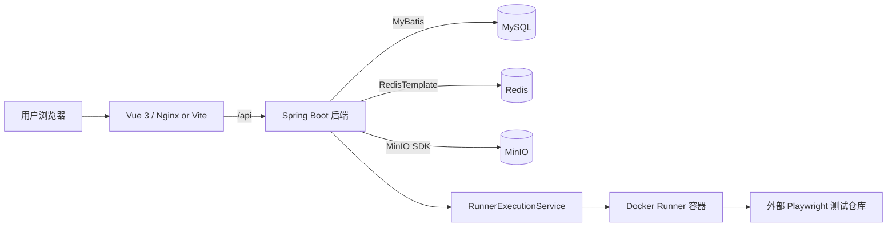

# Playwright Test Platform

一个面向 Playwright 自动化测试的执行与管理平台。平台支持维护测试仓库、配置测试场景、手动或定时触发任务，并统一查看任务状态、用例结果、阶段日志、截图、视频、Trace 等运行产物。

---

## 1. 项目定位

传统 Playwright 测试通常分散在不同仓库、机器和命令行环境中，执行记录、日志、截图、视频、Trace 和结果文件也不容易集中追踪。本项目把这些能力平台化：

- 管理测试仓库配置：Git 地址、默认分支、工作目录、安装命令、测试执行命令、结果文件路径和产物目录。
- 管理测试场景：关联仓库、浏览器、测试选择器、环境变量、Cron 定时规则。
- 执行测试任务：支持手动触发、定时触发、任务取消和重新执行。
- 查看执行结果：任务状态、阶段日志、用例结果、截图、视频、Trace 和报告。
- 统一运行环境：通过 Docker Compose 启动 MySQL、Redis、MinIO、后端和前端。

---

## 2. 技术栈

| 分层 | 技术 | 说明 |
|---|---|---|
| 前端 | Vue 3、TypeScript、Vite、Pinia、Element Plus、Axios、Vitest | 后台页面、状态管理、接口请求和单元测试 |
| 后端 | Spring Boot 3.5、Spring Web、MyBatis、Flyway、Spring Data Redis | REST API、业务编排、数据库迁移和缓存 |
| 存储 | MySQL、Redis、MinIO | 结构化数据、详情缓存、对象文件 |
| 执行 | Local Runner、Docker Runner、Playwright Runner 镜像 | 执行外部测试仓库命令 |
| 工程化 | Docker、Docker Compose、GitHub Actions、JaCoCo | 本地开发、单机部署、CI 和覆盖率 |

后端持久层只使用注解式 MyBatis，Flyway 管理 schema，不使用 JPA，也不使用 XML Mapper。

---

## 3. 系统架构



核心设计：

- 前端负责配置录入、任务状态展示、日志和产物查看。
- 后端负责业务规则、任务调度、异步执行编排、结果解析和产物归档。
- MySQL 保存用户、空间、仓库、场景、任务、用例结果和产物元数据。
- Redis 缓存仓库详情、场景详情和任务详情，并处理缓存穿透、击穿、雪崩风险。
- MinIO 保存截图、视频、Trace、阶段日志、头像等对象文件。
- 长任务交给自定义线程池和 Runner 执行，不阻塞 Spring Web 请求线程。

---

## 4. 目录结构

```text
.
├── README.md
├── docker-compose.yml
├── docker-compose.prod.yml
├── docs
│   ├── deployment.md
│   ├── docker.md
│   └── guide.md
├── playwright-platform-server
│   ├── Dockerfile
│   ├── Dockerfile.dev
│   ├── pom.xml
│   └── src
└── playwright-platform-web
    ├── Dockerfile
    ├── Dockerfile.dev
    ├── package.json
    └── src
```

| 路径 | 作用 |
|---|---|
| `playwright-platform-server` | Spring Boot 后端 |
| `playwright-platform-web` | Vue 3 + Vite 前端 |
| `docker-compose.yml` | 本地开发编排 |
| `docker-compose.prod.yml` | 单机生产部署编排 |
| `docs/deployment.md` | 生产部署手册 |
| `docs/docker.md` | Docker 文件职责说明 |
| `docs/guide.md` | 项目架构与技术讲解指南 |

---

## 5. 快速启动：Docker Compose

推荐本地直接用 Docker Compose 启动完整开发环境。

### 5.1 环境要求

- Docker Desktop 或 Docker Engine。
- Docker Compose Plugin。
- Git。

如果不使用 Docker Compose，本机还需要安装：

- Java 21。
- Maven 3.9+。
- Node.js 20+。
- npm。
- MySQL 8+。
- Redis 7+。
- MinIO。

### 5.2 创建 `.env`

首次启动前，在项目根目录创建本机私有 `.env` 文件。该文件已被 `.gitignore` 忽略，不会上传到 GitHub。

```env
# Frontend
PLATFORM_WEB_HOST_PORT=5173
PLATFORM_WEB_API_PROXY_TARGET=http://server:8080

# Backend - Server
PLATFORM_SERVER_HOST_PORT=8080

# Backend - MySQL
PLATFORM_DB_NAME=playwright_platform
PLATFORM_DB_URL=jdbc:mysql://mysql:3306/playwright_platform?useSSL=false&allowPublicKeyRetrieval=true&createDatabaseIfNotExist=true&serverTimezone=UTC
PLATFORM_DB_USERNAME=root
PLATFORM_DB_PASSWORD=<your-db-password>
PLATFORM_MYSQL_HOST_PORT=4306

# Backend - Redis
PLATFORM_REDIS_HOST=redis
PLATFORM_REDIS_PORT=6379
PLATFORM_REDIS_HOST_PORT=7379
PLATFORM_REDIS_PASSWORD=<your-redis-password>

# Backend - MinIO
PLATFORM_MINIO_ENDPOINT=http://minio:9000
PLATFORM_MINIO_PUBLIC_ENDPOINT=http://localhost:10000
PLATFORM_MINIO_API_HOST_PORT=10000
PLATFORM_MINIO_CONSOLE_HOST_PORT=10001
PLATFORM_MINIO_ACCESS_KEY=<your-minio-access-key>
PLATFORM_MINIO_SECRET_KEY=<your-minio-secret-key>
PLATFORM_STORAGE_BUCKET=qa-report

# Backend - Runner
PLATFORM_RUNNER_MODE=docker
PLATFORM_RUNNER_WORKSPACE_ROOT=/runner-workspaces
PLATFORM_RUNNER_HOST_WORKSPACE_ROOT=<absolute-path-to-project>/.runner-workspaces
PLATFORM_RUNNER_DOCKER_IMAGE=mcr.microsoft.com/playwright:v1.44.0-jammy
PLATFORM_RUNNER_DOCKER_NETWORK=bridge
PLATFORM_RUNNER_DOCKER_MEMORY=2g
PLATFORM_RUNNER_DOCKER_CPUS=2
PLATFORM_RUNNER_DOCKER_CONTAINER_WORKSPACE_ROOT=/workspace/task
```

注意：

- 不要把真实密码写进代码库。
- `PLATFORM_MINIO_ENDPOINT` 是后端访问 MinIO 的 Docker 内部地址，保持 `http://minio:9000`。
- `PLATFORM_MINIO_PUBLIC_ENDPOINT` 用于生成公网可访问的 MinIO 预签名地址，本地通常是 `http://localhost:10000`；任务产物下载和 Trace 分享仍优先通过后端平台代理接口返回。
- `PLATFORM_RUNNER_HOST_WORKSPACE_ROOT` 建议填写宿主机绝对路径，例如 `/opt/testplatform/.runner-workspaces`。
- 如果 MySQL、Redis 或 MinIO 已经使用 Docker volume 初始化过，修改 `.env` 密码不会自动修改已有 volume 内账号密码。

### 5.3 启动

```bash
docker compose config
docker compose up -d --build
docker compose ps
```

查看日志：

```bash
docker compose logs -f server
docker compose logs -f web
```

访问地址：

| 服务 | 地址 |
|---|---|
| 前端 | `http://localhost:5173` |
| 后端 | `http://localhost:8080` |
| MySQL | `localhost:4306` |
| Redis | `localhost:7379` |
| MinIO API | `http://localhost:10000` |
| MinIO Console | `http://localhost:10001` |

停止服务：

```bash
docker compose down
```

删除容器和数据卷：

```bash
docker compose down -v
```

`down -v` 会删除 MySQL、Redis、MinIO、Maven 缓存和前端依赖数据卷，谨慎执行。

---

## 6. 生产部署

单机生产部署使用 `docker-compose.prod.yml` 和生产 Dockerfile。

```bash
docker compose -f docker-compose.prod.yml config
docker compose -f docker-compose.prod.yml up -d --build
docker compose -f docker-compose.prod.yml ps
```

生产环境特点：

- 后端使用 `playwright-platform-server/Dockerfile`，构建 jar 后用 JRE 运行。
- 前端使用 `playwright-platform-web/Dockerfile`，构建 `dist` 后由 Nginx 托管。
- MySQL、Redis、后端默认只在 Docker 内部网络访问。
- 敏感配置通过服务器私有 `.env` 注入。
- 正式对团队开放时，推荐前后端分域名：
  - 前端：`https://test-platform.example.com`
  - 后端 API：`https://api.test-platform.example.com`

完整部署步骤见 `docs/deployment.md`。

---

## 7. Docker 文件说明

| 文件 | 作用 |
|---|---|
| `playwright-platform-server/Dockerfile.dev` | 后端开发镜像，挂载源码后运行 `mvn spring-boot:run` |
| `playwright-platform-server/Dockerfile` | 后端生产镜像，多阶段构建 jar，运行阶段只保留 JRE |
| `playwright-platform-server/.dockerignore` | 排除后端构建产物、IDE 文件等 |
| `playwright-platform-web/Dockerfile.dev` | 前端开发镜像，运行 Vite dev server |
| `playwright-platform-web/Dockerfile` | 前端生产镜像，Node 构建后由 Nginx 托管 |
| `playwright-platform-web/.dockerignore` | 排除 `node_modules`、`dist`、`.vite` 等 |
| `docker-compose.yml` | 本地开发多服务编排 |
| `docker-compose.prod.yml` | 单机生产多服务编排 |

详细说明见 `docs/docker.md`。

---

## 8. 后端核心能力

### 8.1 数据库与迁移

- Flyway 启动时自动执行 `playwright-platform-server/src/main/resources/db/migration` 下的迁移脚本。
- 当前迁移覆盖初始化 schema、调度事件、空间模型、用户会话和自助注册约束。
- `SCHEMA_OVERVIEW.sql` 仅作为结构参考，不是首选初始化方式。

### 8.2 Redis 详情缓存

仓库详情、场景详情和任务详情会先查 Redis。列表接口、任务日志、用例、产物等目前直接查 MySQL 或对象存储相关服务。

缓存策略：

- 空值缓存：降低不存在 ID 的重复数据库查询，防穿透。
- TTL 随机抖动：避免大量 key 同时过期，防雪崩。
- 互斥刷新：热点 key 未命中时减少并发回源，防击穿。
- 写后失效：仓库、场景、任务变更后删除对应详情缓存。

### 8.3 事务策略

- 仓库、场景创建/更新/删除使用短事务。
- 任务创建、取消、状态更新使用短事务。
- Playwright 安装、测试执行、结果解析、产物上传不包在一个大事务里。
- 长任务状态落库由独立 mutation service 分阶段提交，避免长时间占用数据库连接和锁。

### 8.4 多线程与 Runner

- HTTP 请求线程由内嵌 Tomcat 管理，只负责接收请求和快速返回。
- 长任务执行使用自定义 `taskExecutionExecutor`。
- Docker Runner 通过 Docker socket 启动短生命周期 Playwright 容器执行测试。
- Runner workspace 由 `PLATFORM_RUNNER_HOST_WORKSPACE_ROOT` 和 `PLATFORM_RUNNER_WORKSPACE_ROOT` 控制。
- 线程池满载时 fail-fast，任务会被标记为 `FAILED` / `SYSTEM_BUSY`，避免无限排队。

### 8.5 对象存储

- MinIO 保存截图、视频、Trace、阶段日志和头像。
- MySQL 只保存 bucket、object key、content type、size 等元数据。
- 运行产物下载通过后端平台代理接口返回，避免前端直接依赖 MinIO 内网地址。

---

## 9. 本地非 Docker 启动

不推荐新手使用这种方式，除非你已经本机准备好了 MySQL、Redis 和 MinIO。

### 9.1 启动后端

```bash
cd playwright-platform-server
mvn spring-boot:run -Dspring-boot.run.profiles=dev
```

后端默认监听：

```text
http://localhost:8080
```

### 9.2 启动前端

```bash
cd playwright-platform-web
npm ci
npm run dev
```

Vite 默认访问：

```text
http://localhost:5173
```

---

## 10. 测试与 CI

### 10.1 本地测试

后端：

```bash
cd playwright-platform-server
mvn test
```

前端：

```bash
cd playwright-platform-web
npm test
npm run build
```

### 10.2 GitHub Actions

项目使用 GitHub Actions 作为主干质量门禁。每次 `push` 和 `pull_request` 会执行：

| Job | 步骤 |
|---|---|
| backend | Java 21、Maven cache、`mvn test`、上传 JaCoCo 覆盖率 |
| frontend | Node 20、`npm ci`、`npm test -- --coverage`、`npm run build`、`npm audit` |

覆盖率报告：

- 后端：`playwright-platform-server/target/site/jacoco/index.html`。
- 前端：`playwright-platform-web/coverage/index.html`。

---

## 11. 核心接口

| 接口 | 说明 |
|---|---|
| `GET /api/auth/public-key` | 获取登录加密公钥 |
| `POST /api/auth/login` | 登录 |
| `POST /api/auth/register` | 注册 |
| `GET /api/auth/me` | 获取当前用户 |
| `PUT /api/auth/profile` | 更新当前用户资料 |
| `POST /api/auth/avatar` | 上传当前用户头像 |
| `POST /api/auth/logout` | 退出登录 |
| `GET /api/spaces` | 当前用户空间列表 |
| `GET /api/spaces/plaza` | 空间广场 |
| `POST /api/spaces` | 创建空间 |
| `GET /api/spaces/{spaceId}/access-requests` | 空间加入/权限申请列表 |
| `POST /api/spaces/{spaceId}/access-requests` | 提交空间加入/权限申请 |
| `POST /api/spaces/{spaceId}/access-requests/{requestId}/approve` | 审批通过空间申请 |
| `POST /api/spaces/{spaceId}/access-requests/{requestId}/reject` | 拒绝空间申请 |
| `GET /api/spaces/{spaceId}/repos` | 仓库列表 |
| `POST /api/spaces/{spaceId}/repos` | 创建仓库 |
| `GET /api/spaces/{spaceId}/scenes` | 场景列表 |
| `POST /api/spaces/{spaceId}/scenes` | 创建场景 |
| `POST /api/spaces/{spaceId}/scenes/{sceneId}/run` | 执行场景 |
| `GET /api/spaces/{spaceId}/tasks` | 任务列表 |
| `GET /api/spaces/{spaceId}/scenes/{sceneId}/tasks` | 某个场景的任务 |
| `GET /api/spaces/{spaceId}/tasks/{taskId}` | 任务详情 |
| `POST /api/spaces/{spaceId}/tasks/{taskId}/cancel` | 取消任务 |
| `GET /api/spaces/{spaceId}/tasks/{taskId}/diagnostics` | 任务诊断信息 |
| `GET /api/spaces/{spaceId}/tasks/{taskId}/artifacts` | 任务产物 |
| `GET /api/spaces/{spaceId}/tasks/{taskId}/artifacts/{artifactId}/download` | 下载任务产物 |
| `POST /api/spaces/{spaceId}/tasks/{taskId}/artifacts/{artifactId}/trace-share` | 创建 Trace 分享下载地址 |
| `GET /api/public/traces/download` | 使用分享 token 下载 Trace |
| `GET /api/spaces/{spaceId}/tasks/{taskId}/cases` | 用例结果 |
| `GET /api/spaces/{spaceId}/tasks/{taskId}/cases/{caseResultId}/artifacts` | 某条用例关联产物 |
| `GET /api/spaces/{spaceId}/tasks/{taskId}/logs` | 阶段日志 |
| `GET /api/spaces/{spaceId}/tasks/{taskId}/logs/{logId}/download` | 下载阶段日志 |
| `GET /api/spaces/{spaceId}/schedule-events` | 调度事件列表 |
| `POST /api/spaces/{spaceId}/schedule-events/{eventId}/retry` | 重试调度事件 |

---

## 12. 测试仓库接入建议

平台中的“测试仓库”指被平台拉取并执行的 Playwright 自动化项目。接入时建议：

- `工作目录`：单仓库项目可留空，Monorepo 填写子目录。
- `安装命令`：建议使用 `npm ci` 或与测试仓库锁文件匹配的安装命令。
- `测试执行命令`：例如 `npx playwright test`。
- 如果用 npm script 包装测试命令，保持参数透传，例如 `npm run test:e2e --`。
- `测试目录`：相对工作目录，例如 `tests`。
- `结果索引文件`：相对工作目录，例如 `test-results/.playwright-results.json`。
- `运行产物目录`：相对工作目录，例如 `.playwright-artifacts`。
- Runner 镜像已包含浏览器环境时，不建议默认执行 `npx playwright install`，避免重复下载浏览器。
- 测试仓库的 `@playwright/test` 版本建议与 Runner 镜像版本对齐。

---

## 13. 文档导航

| 文档 | 内容 |
|---|---|
| `docs/guide.md` | 项目前后端架构、文件职责、核心业务链路、常见问题讲解 |
| `docs/docker.md` | Dockerfile、Dockerfile.dev、.dockerignore 与 Compose 职责划分 |
| `docs/deployment.md` | 单机生产部署、`.env`、验证、备份、回滚、域名 HTTPS、排障 |

---

## 14. 注意事项

- `.env` 保存本地或服务器真实配置，不要提交 GitHub。
- `.env.example` 当前按项目要求不保留，创建 `.env` 时参考本文档和 `docs/deployment.md`。
- MySQL、Redis、MinIO 使用 Docker volume 初始化后，修改 `.env` 密码不会自动修改已有数据卷里的账号密码。
- 不要公网开放 MySQL 和 Redis。
- MinIO Console 只建议限制来源 IP 后开放。
- Docker Runner 需要挂载 `/var/run/docker.sock`，该权限较高，只建议用于本地开发或受控服务器。
- 前端项目内如果存在 Vite 模板说明，以本仓库根目录 README 为准。
