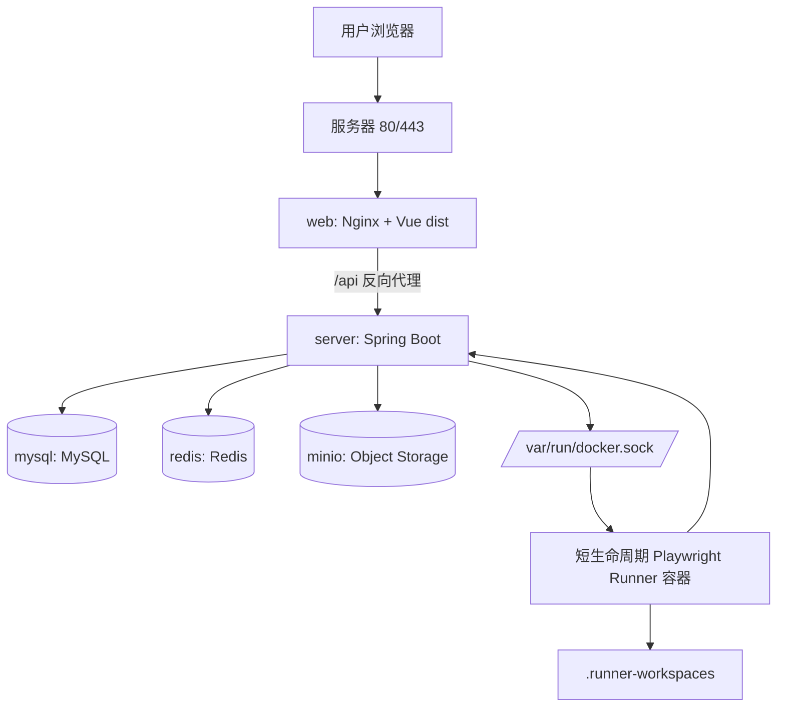

# 单机生产部署指南

本文档说明如何把 Playwright Test Platform 部署到一台 Linux 服务器上。当前推荐先使用 Docker Compose 完成单机生产部署，后续再按团队规模升级到域名、HTTPS、镜像仓库、CI/CD、独立 Runner 和监控体系。

相关文档：

- `docs/docker.md`：说明 `Dockerfile`、`Dockerfile.dev`、`.dockerignore` 与 Compose 的职责划分。
- `docs/guide.md`：项目技术架构总览。

---

## 1. 部署架构

### 1.1 单机生产架构图



### 1.2 服务职责

| 服务 | 职责 | 是否建议公网暴露 |
|---|---|---|
| `web` | 托管前端静态资源，并在单机模式下代理 `/api` 到后端 | 是，暴露 `80` 或 `443` |
| `server` | 提供后端 API、任务编排、调度、结果解析和产物归档 | 否，默认只在 Docker 内部网络访问 |
| `mysql` | 保存用户、空间、仓库、场景、任务、用例结果等结构化数据 | 否 |
| `redis` | 保存详情缓存、缓存互斥锁等临时数据 | 否 |
| `minio` | 保存截图、视频、Trace、日志、头像等对象文件 | 可选，只建议限制来源 IP |
| `minio-init` | 初始化 MinIO bucket | 否，一次性初始化容器 |

### 1.3 端口规划

| 端口 | 用途 | 建议 |
|---|---|---|
| `80` | HTTP 访问、证书申请入口 | 必开 |
| `443` | HTTPS 访问 | 正式环境必开 |
| `10000` | MinIO API，映射容器 `9000` | 可选，建议限制来源 IP |
| `10001` | MinIO Console，映射容器 `9001` | 可选，建议限制来源 IP |
| `3306` | MySQL 容器内部端口 | 不要公网开放 |
| `6379` | Redis 容器内部端口 | 不要公网开放 |
| `8080` | 后端容器内部端口 | 不要公网开放 |

---

## 2. 部署前检查清单

| 检查项 | 要求 | 说明 |
|---|---|---|
| 服务器系统 | Ubuntu 22.04 或 Ubuntu 24.04 | 本文命令按 Ubuntu 编写 |
| CPU/内存 | 推荐 4 核 8GB，最低 2 核 4GB | Playwright Runner 会消耗较多资源 |
| 磁盘 | 推荐 100GB，最低 40GB | 任务 workspace 和 MinIO 产物会占用空间 |
| 安全组 | 开放 `80`、`443`，可选开放 `10000`、`10001` | MySQL、Redis 不开放公网 |
| Docker | Docker Engine + Compose Plugin | 使用 `docker compose` 命令 |
| Git | 已安装 | 用于拉取代码和更新版本 |
| `.env` | 已准备生产强密码 | 不提交 GitHub |
| 域名 | 可选 | 没有域名也可先用服务器 IP 跑通 |

---

## 3. 准备服务器

### 3.1 登录服务器

```bash
ssh root@<your-server-ip>
```

### 3.2 更新系统基础包

```bash
apt update
apt install -y ca-certificates curl git openssl
```

### 3.3 创建部署目录

```bash
mkdir -p /opt
cd /opt
```

---

## 4. 安装 Docker

### 4.1 安装 Docker Engine 和 Compose 插件

```bash
install -m 0755 -d /etc/apt/keyrings
curl -fsSL https://download.docker.com/linux/ubuntu/gpg -o /etc/apt/keyrings/docker.asc
chmod a+r /etc/apt/keyrings/docker.asc
echo "deb [arch=$(dpkg --print-architecture) signed-by=/etc/apt/keyrings/docker.asc] https://download.docker.com/linux/ubuntu $(. /etc/os-release && echo "$VERSION_CODENAME") stable" > /etc/apt/sources.list.d/docker.list
apt update
apt install -y docker-ce docker-ce-cli containerd.io docker-buildx-plugin docker-compose-plugin
```

### 4.2 验证安装

```bash
docker --version
docker compose version
docker ps
```

如果 `docker ps` 能正常输出容器列表，说明 Docker 已可用。

---

## 5. 拉取代码

```bash
cd /opt
git clone https://github.com/MenXiaoHuan/testplatform.git
cd testplatform
```

如果服务器已经有旧代码：

```bash
cd /opt/testplatform
git pull
```

---

## 6. 创建生产环境变量

### 6.1 生成强密码

可以在服务器上生成随机密码：

```bash
openssl rand -hex 24
```

建议至少生成三组：

- MySQL root 密码。
- Redis 密码。
- MinIO secret key。

### 6.2 创建 `.env`

```bash
cd /opt/testplatform
nano .env
```

写入以下内容，并替换尖括号占位值：

```env
# Frontend
PLATFORM_WEB_HOST_PORT=80

# Backend - MySQL
PLATFORM_DB_NAME=playwright_platform
PLATFORM_DB_URL=jdbc:mysql://mysql:3306/playwright_platform?useSSL=false&allowPublicKeyRetrieval=true&createDatabaseIfNotExist=true&serverTimezone=UTC
PLATFORM_DB_USERNAME=root
PLATFORM_DB_PASSWORD=<your-db-password>

# Backend - Redis
PLATFORM_REDIS_HOST=redis
PLATFORM_REDIS_PORT=6379
PLATFORM_REDIS_PASSWORD=<your-redis-password>

# Backend - MinIO
PLATFORM_MINIO_ENDPOINT=http://minio:9000
PLATFORM_MINIO_INTERNAL_ENDPOINT=http://minio:9000
PLATFORM_MINIO_API_HOST_PORT=10000
PLATFORM_MINIO_CONSOLE_HOST_PORT=10001
PLATFORM_MINIO_ACCESS_KEY=<your-minio-access-key>
PLATFORM_MINIO_SECRET_KEY=<your-minio-secret-key>
PLATFORM_STORAGE_BUCKET=qa-report

# Backend - Runner
PLATFORM_RUNNER_MODE=docker
PLATFORM_RUNNER_WORKSPACE_ROOT=/workspace/.runner-workspaces
PLATFORM_RUNNER_HOST_WORKSPACE_ROOT=./.runner-workspaces
PLATFORM_RUNNER_DOCKER_IMAGE=mcr.microsoft.com/playwright:v1.44.0-jammy
PLATFORM_RUNNER_DOCKER_NETWORK=bridge
PLATFORM_RUNNER_DOCKER_MEMORY=2g
PLATFORM_RUNNER_DOCKER_CPUS=2
PLATFORM_RUNNER_DOCKER_CONTAINER_WORKSPACE_ROOT=/workspace/task
```

### 6.3 变量说明

| 变量 | 作用 | 是否敏感 | 生产建议 |
|---|---|---|---|
| `PLATFORM_WEB_HOST_PORT` | 前端 Web 对外端口 | 否 | 没接 HTTPS 前可用 `80` |
| `PLATFORM_DB_NAME` | MySQL 数据库名 | 否 | 默认 `playwright_platform` |
| `PLATFORM_DB_URL` | 后端连接 MySQL 的 JDBC URL | 否 | 使用 Docker 内部主机名 `mysql` |
| `PLATFORM_DB_USERNAME` | MySQL 用户名 | 是 | 单机初期可用 `root` |
| `PLATFORM_DB_PASSWORD` | MySQL 密码 | 是 | 使用强随机密码 |
| `PLATFORM_REDIS_HOST` | Redis 主机名 | 否 | Compose 内使用 `redis` |
| `PLATFORM_REDIS_PORT` | Redis 容器内部端口 | 否 | 保持 `6379` |
| `PLATFORM_REDIS_PASSWORD` | Redis 密码 | 是 | 使用强随机密码 |
| `PLATFORM_MINIO_ENDPOINT` | 后端访问 MinIO 的地址 | 否 | Compose 内保持 `http://minio:9000` |
| `PLATFORM_MINIO_INTERNAL_ENDPOINT` | 初始化 bucket 使用的 MinIO 内网地址 | 否 | Compose 内保持 `http://minio:9000` |
| `PLATFORM_MINIO_API_HOST_PORT` | MinIO API 宿主机端口 | 否 | 当前建议 `10000` |
| `PLATFORM_MINIO_CONSOLE_HOST_PORT` | MinIO Console 宿主机端口 | 否 | 当前建议 `10001` |
| `PLATFORM_MINIO_ACCESS_KEY` | MinIO 用户名 | 是 | 不要使用默认弱口令 |
| `PLATFORM_MINIO_SECRET_KEY` | MinIO 密码 | 是 | 使用强随机密码 |
| `PLATFORM_STORAGE_BUCKET` | 产物 bucket | 否 | 默认 `qa-report` |
| `PLATFORM_RUNNER_MODE` | Runner 模式 | 否 | 当前推荐 `docker` |
| `PLATFORM_RUNNER_HOST_WORKSPACE_ROOT` | 宿主机任务 workspace | 否 | 相对路径即可 |
| `PLATFORM_RUNNER_DOCKER_IMAGE` | Playwright Runner 镜像 | 否 | 和测试代码所需版本匹配 |
| `PLATFORM_RUNNER_DOCKER_MEMORY` | Runner 内存限制 | 否 | 按服务器规格调整 |
| `PLATFORM_RUNNER_DOCKER_CPUS` | Runner CPU 限制 | 否 | 按服务器规格调整 |

### 6.4 注意事项

- `.env` 是服务器私有文件，不提交 GitHub。
- 生产 Compose 不读取 `PLATFORM_SERVER_HOST_PORT`、`PLATFORM_MYSQL_HOST_PORT`、`PLATFORM_REDIS_HOST_PORT` 和 `PLATFORM_WEB_API_PROXY_TARGET`。
- `PLATFORM_MINIO_ENDPOINT` 和 `PLATFORM_MINIO_INTERNAL_ENDPOINT` 使用 Docker 内部地址，不要改成宿主机端口 `10000`。
- MySQL、Redis、MinIO 第一次初始化后，修改 `.env` 密码不会自动修改已有 Docker volume 内的账号密码。

---

## 7. 启动生产服务

### 7.1 检查 Compose 配置

```bash
docker compose -f docker-compose.prod.yml config
```

如果 `.env` 缺少必填变量，命令会直接报错。

### 7.2 启动服务

```bash
docker compose -f docker-compose.prod.yml up -d --build
```

首次启动会构建前后端镜像并拉取 MySQL、Redis、MinIO 镜像，耗时取决于服务器网络。

### 7.3 查看容器状态

```bash
docker compose -f docker-compose.prod.yml ps
```

期望看到：

- `mysql` 为 `healthy`。
- `redis` 为 `healthy`。
- `minio` 为 `healthy`。
- `minio-init` 为 `exited` 且成功完成。
- `server` 为 `running`。
- `web` 为 `running`。

### 7.4 查看日志

查看后端日志：

```bash
docker compose -f docker-compose.prod.yml logs -f server
```

查看前端日志：

```bash
docker compose -f docker-compose.prod.yml logs -f web
```

查看所有日志：

```bash
docker compose -f docker-compose.prod.yml logs -f
```

---

## 8. 验证部署结果

### 8.1 浏览器访问

如果 `PLATFORM_WEB_HOST_PORT=80`，浏览器访问：

```text
http://<your-server-ip>
```

如果已经配置域名和 HTTPS，访问：

```text
https://test-platform.example.com
```

### 8.2 命令行验证

验证前端入口：

```bash
curl -I http://127.0.0.1
```

验证后端接口是否能通过前端 Nginx 代理访问：

```bash
curl -i http://127.0.0.1/api/repos
```

验证 MinIO Console 端口是否打开：

```bash
curl -I http://127.0.0.1:10001
```

验证数据库表是否创建：

```bash
docker compose -f docker-compose.prod.yml exec mysql \
  mysql -uroot -p"$PLATFORM_DB_PASSWORD" -D "$PLATFORM_DB_NAME" \
  -e "SHOW TABLES;"
```

验证 Redis 密码：

```bash
docker compose -f docker-compose.prod.yml exec redis \
  redis-cli -a "$PLATFORM_REDIS_PASSWORD" ping
```

期望输出：

```text
PONG
```

### 8.3 页面功能验证

| 验证项 | 期望结果 |
|---|---|
| 打开前端页面 | 页面正常加载 |
| 注册/登录 | 用户可进入系统 |
| 创建仓库 | 数据保存成功 |
| 创建场景 | 能关联仓库并保存配置 |
| 手动执行任务 | 任务进入队列并开始执行 |
| 查看任务详情 | 状态、用例、日志、产物可查看 |
| 上传产物 | MinIO 中能看到对象文件 |
| 后端日志 | 无 MySQL、Redis、MinIO 连接错误 |

---

## 9. 日常更新

### 9.1 更新到最新代码

```bash
cd /opt/testplatform
git pull
docker compose -f docker-compose.prod.yml up -d --build
```

### 9.2 查看当前版本

```bash
git rev-parse --short HEAD
git log -1 --oneline
```

### 9.3 只重启服务

```bash
docker compose -f docker-compose.prod.yml restart
```

### 9.4 只重启后端

```bash
docker compose -f docker-compose.prod.yml restart server
```

### 9.5 只重启前端

```bash
docker compose -f docker-compose.prod.yml restart web
```

---

## 10. 停止、清理和重置

### 10.1 停止服务但保留数据

```bash
docker compose -f docker-compose.prod.yml down
```

### 10.2 清理构建缓存

```bash
docker builder prune
```

### 10.3 删除所有数据并重新初始化

危险操作，会删除 MySQL、Redis、MinIO 数据：

```bash
docker compose -f docker-compose.prod.yml down -v
```

只有在测试环境或明确要重置生产数据时才执行。

---

## 11. 数据备份与恢复

### 11.1 需要备份什么

| 数据 | 位置 | 说明 |
|---|---|---|
| MySQL 业务数据 | Docker volume `mysql-data` | 用户、空间、仓库、场景、任务、结果 |
| Redis 数据 | Docker volume `redis-data` | 缓存和临时数据，重要性低于 MySQL |
| MinIO 产物 | Docker volume `minio-data` | 截图、视频、Trace、日志、头像 |
| Runner workspace | `.runner-workspaces` | 任务运行工作区，可按需清理 |
| 环境变量 | `.env` | 密码和部署配置，必须安全备份 |

### 11.2 MySQL 备份

```bash
mkdir -p /opt/backups/testplatform
docker compose -f docker-compose.prod.yml exec mysql \
  mysqldump -uroot -p"$PLATFORM_DB_PASSWORD" "$PLATFORM_DB_NAME" \
  > /opt/backups/testplatform/mysql-$(date +%F-%H%M%S).sql
```

### 11.3 MySQL 恢复

```bash
docker compose -f docker-compose.prod.yml exec -T mysql \
  mysql -uroot -p"$PLATFORM_DB_PASSWORD" "$PLATFORM_DB_NAME" \
  < /opt/backups/testplatform/<backup-file>.sql
```

### 11.4 MinIO 和 Redis 备份

单机最简单方式是停机后打包 Docker volume 数据目录，正式生产建议使用云盘快照或对象存储复制策略。

```bash
docker compose -f docker-compose.prod.yml down
tar -czf /opt/backups/testplatform/runner-workspaces-$(date +%F-%H%M%S).tar.gz .runner-workspaces
docker compose -f docker-compose.prod.yml up -d
```

如果使用云服务器，优先使用云盘快照备份 Docker 数据目录。

---

## 12. 回滚方案

### 12.1 回滚到上一个 Git 提交

查看最近提交：

```bash
git log --oneline -5
```

切换到指定提交：

```bash
git checkout <commit-sha>
docker compose -f docker-compose.prod.yml up -d --build
```

确认恢复后，如果要回到 `main` 最新版本：

```bash
git checkout main
git pull
docker compose -f docker-compose.prod.yml up -d --build
```

### 12.2 回滚前注意

- 如果新版本已经执行了数据库迁移，代码回滚不一定能自动回滚 schema。
- 生产更新前建议先备份 MySQL。
- 如果只是前端页面问题，优先只回滚前端镜像或代码。

---

## 13. 域名和 HTTPS

### 13.1 推荐域名

正式给团队使用时，推荐前后端分域名：

```text
https://test-platform.example.com
https://api.test-platform.example.com
```

| 域名 | 指向 | 说明 |
|---|---|---|
| `test-platform.example.com` | 前端入口 | 用户访问页面 |
| `api.test-platform.example.com` | 后端 API | 后续可独立限流、监控、扩容 |

### 13.2 当前 Compose 与分域名的关系

当前 `docker-compose.prod.yml` 先保证单机可运行：

- `web` 容器暴露 `80`。
- 前端 Nginx 会把 `/api` 代理给 `server:8080`。
- 这种模式不需要额外 CORS。

正式分域名时需要补充：

- DNS：两个域名都解析到服务器公网 IP。
- HTTPS：证书覆盖两个域名。
- 前端：支持 `VITE_API_BASE_URL=https://api.test-platform.example.com`。
- 后端：配置 CORS，只允许可信前端域名访问。
- 反向代理：使用 Caddy 或 Nginx 分别代理前端和 API。

### 13.3 Caddy 方向示例

如果后续引入 Caddy，可参考方向：

```caddyfile
test-platform.example.com {
    reverse_proxy web:80
}

api.test-platform.example.com {
    reverse_proxy server:8080
}
```

该示例只是方向说明，正式接入时需要结合实际网络、证书、Compose 网络和 CORS 配置调整。

---

## 14. 常见问题排查

### 14.1 Compose 配置报缺少变量

现象：

```text
Set PLATFORM_DB_PASSWORD in .env
```

处理：

- 检查 `.env` 是否在项目根目录。
- 检查变量名是否拼写正确。
- 执行 `docker compose -f docker-compose.prod.yml config` 验证。

### 14.2 MySQL 密码不一致

现象：

- `mysql` 容器启动正常，但 `server` 连不上数据库。
- 修改 `.env` 密码后仍然认证失败。

原因：

- MySQL 第一次初始化后，root 密码保存在 volume 内。
- 后续修改 `.env` 不会自动修改已有 volume 里的密码。

处理：

- 生产环境：优先改回原密码。
- 测试环境：可执行 `docker compose -f docker-compose.prod.yml down -v` 重建数据卷。

### 14.3 Redis 认证失败

现象：

```text
NOAUTH Authentication required
```

处理：

```bash
docker compose -f docker-compose.prod.yml exec redis \
  redis-cli -a "$PLATFORM_REDIS_PASSWORD" ping
```

如果密码不一致，需要检查 `.env` 和 Redis volume 初始化状态。

### 14.4 MinIO 登录失败

处理：

- 确认使用 `PLATFORM_MINIO_ACCESS_KEY` 和 `PLATFORM_MINIO_SECRET_KEY` 登录。
- 确认访问的是 Console 端口 `10001`，不是 API 端口 `10000`。
- 确认安全组开放了 `10001`，且来源 IP 被允许。

### 14.5 `minio-init` 没有成功完成

查看日志：

```bash
docker compose -f docker-compose.prod.yml logs minio-init
```

常见原因：

- MinIO 密码配置不一致。
- `PLATFORM_MINIO_INTERNAL_ENDPOINT` 不正确。
- MinIO volume 已用旧账号密码初始化。

处理：

- 确认 `PLATFORM_MINIO_INTERNAL_ENDPOINT=http://minio:9000`。
- 确认 `.env` 中 MinIO 账号密码和已有 volume 一致。
- 测试环境可删除 volume 后重新初始化。

### 14.6 后端启动失败

查看日志：

```bash
docker compose -f docker-compose.prod.yml logs --tail=200 server
```

重点检查：

- MySQL 连接错误。
- Redis 密码错误。
- MinIO endpoint 或账号密码错误。
- Flyway 迁移失败。
- Runner workspace 权限问题。

### 14.7 Runner 执行失败

重点检查：

- 服务器是否能拉取 `PLATFORM_RUNNER_DOCKER_IMAGE`。
- `server` 是否挂载 `/var/run/docker.sock`。
- `.runner-workspaces` 是否有写权限。
- 服务器 CPU、内存是否不足。
- 测试仓库的安装命令和执行命令是否正确。

### 14.8 端口被占用

检查端口：

```bash
ss -lntp | grep ':80'
ss -lntp | grep ':10000'
ss -lntp | grep ':10001'
```

处理：

- 停止占用端口的服务。
- 或修改 `.env` 中对应端口。

---

## 15. 安全注意事项

| 风险 | 建议 |
|---|---|
| `.env` 泄露 | 不提交 GitHub，只在服务器保存 |
| MySQL/Redis 暴露公网 | 不开放相关端口 |
| MinIO Console 暴露公网 | 限制来源 IP，使用强密码 |
| Docker socket 权限高 | 只部署在受控服务器，后续可拆独立 Runner |
| HTTP 明文访问 | 正式环境配置 HTTPS |
| 弱口令 | 所有密码使用随机强密码 |
| 数据丢失 | 定期备份 MySQL、MinIO 和 `.env` |
| 镜像过旧 | 定期更新基础镜像和系统补丁 |

---

## 16. 部署讲解要点

可以这样介绍部署设计：

> 这个项目使用 Docker Compose 做单机生产部署。Compose 编排 MySQL、Redis、MinIO、Spring Boot 后端和 Vue/Nginx 前端。生产环境使用多阶段 Dockerfile，后端构建成 jar 后用 JRE 运行，前端构建成 dist 后由 Nginx 托管。敏感配置全部放在服务器私有 `.env`，不提交代码库。MySQL、Redis、后端只在 Docker 内部网络访问，外部主要暴露前端入口和可选的 MinIO 管理端口。部署文档还覆盖了 healthcheck、数据备份、版本回滚、域名 HTTPS 和常见问题排查。

---

## 17. 最小部署命令汇总

如果已经完成服务器、Docker 和 `.env` 准备，最小启动流程如下：

```bash
cd /opt/testplatform
docker compose -f docker-compose.prod.yml config
docker compose -f docker-compose.prod.yml up -d --build
docker compose -f docker-compose.prod.yml ps
docker compose -f docker-compose.prod.yml logs -f server
```

浏览器访问：

```text
http://<your-server-ip>
```
