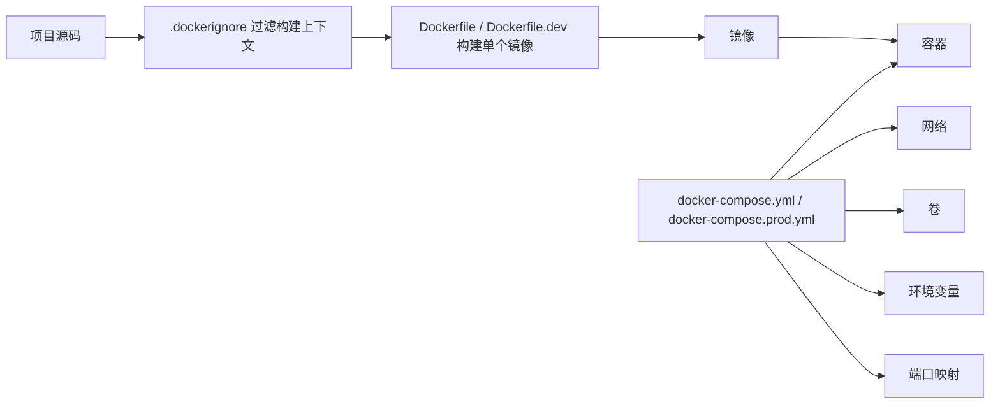
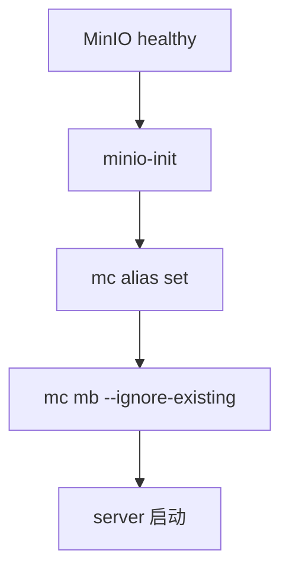

# Docker 文件职责说明

本文档说明本项目中 `Dockerfile`、`Dockerfile.dev`、`.dockerignore` 与 Docker Compose 的职责划分。阅读后应该能清楚回答：

- 为什么不能把所有 Docker 配置都写进 Compose。
- 为什么开发和生产要拆成不同 Dockerfile。
- `.dockerignore` 有什么作用。
- `docker-compose.yml` 和 `docker-compose.prod.yml` 分别适合什么场景。

---

## 1. 一句话理解

| 文件类型 | 负责什么 | 不负责什么 |
|---|---|---|
| `Dockerfile` | 定义单个镜像如何构建 | 不负责多个容器如何一起运行 |
| `Dockerfile.dev` | 定义开发镜像如何运行源码 | 不负责生产发布镜像 |
| `.dockerignore` | 控制哪些文件不进入构建上下文 | 不影响容器运行时挂载 |
| `docker-compose.yml` | 编排本地开发环境多个服务 | 不定义镜像内部构建细节 |
| `docker-compose.prod.yml` | 编排单机生产环境多个服务 | 不替代 CI/CD 或云平台能力 |

可以这样理解：

> Dockerfile 负责“一个镜像怎么做”，Compose 负责“多个容器怎么一起跑”，.dockerignore 负责“构建镜像时哪些文件不要带进去”。成熟项目一般会保留 Dockerfile 和 Compose 的职责边界，而不是把所有东西都塞进 Compose。

---

## 2. 当前 Docker 文件总览

| 文件 | 使用场景 | 被谁使用 | 主要职责 |
|---|---|---|---|
| `playwright-platform-server/Dockerfile.dev` | 后端本地开发 | `docker-compose.yml` | Maven 开发容器，挂载源码后运行 `mvn spring-boot:run` |
| `playwright-platform-server/Dockerfile` | 后端生产构建 | `docker-compose.prod.yml` / CI/CD | 多阶段构建后端 jar，运行阶段只保留 JRE |
| `playwright-platform-server/.dockerignore` | 后端镜像构建 | Docker build | 排除 `target/`、IDE 文件、本机系统文件 |
| `playwright-platform-web/Dockerfile.dev` | 前端本地开发 | `docker-compose.yml` | Node 开发容器，运行 `npm ci && npm run dev` |
| `playwright-platform-web/Dockerfile` | 前端生产构建 | `docker-compose.prod.yml` / CI/CD | 多阶段构建前端 `dist`，用 Nginx 托管 |
| `playwright-platform-web/.dockerignore` | 前端镜像构建 | Docker build | 排除 `node_modules/`、`dist/`、`.vite/` 等 |
| `docker-compose.yml` | 本地开发 | 开发机 Docker Compose | 编排 MySQL、Redis、MinIO、server、web |
| `docker-compose.prod.yml` | 单机生产部署 | 服务器 Docker Compose | 使用生产镜像方式编排服务 |

---

## 3. Dockerfile 与 Compose 的职责边界



### 3.1 Dockerfile 负责

- 选择基础镜像。
- 安装镜像内部需要的依赖。
- 复制构建所需文件。
- 执行构建命令。
- 定义默认启动命令。
- 暴露容器内部端口。

### 3.2 Compose 负责

- 启动哪些服务。
- 服务之间如何依赖。
- 端口如何映射到宿主机。
- 环境变量如何注入。
- 数据卷如何挂载。
- 容器网络如何连通。
- 健康检查和重启策略。

### 3.3 为什么不都写进 Compose

| 如果都写进 Compose | 问题 |
|---|---|
| 构建步骤和运行编排混在一起 | 文件会越来越难维护 |
| 镜像无法独立构建和复用 | CI/CD、镜像仓库、生产发布不方便 |
| 开发和生产边界不清 | 容易把 Maven、Node、源码挂载带到生产 |
| 无法体现标准镜像交付 | 生产部署不应该依赖本地源码目录 |

说明：

> Compose 可以指定 build context 和 dockerfile，但它不适合承载镜像内部所有构建细节。Dockerfile 是镜像定义，Compose 是服务编排，这样拆更清晰，也更接近成熟项目实践。

---

## 4. 后端 Docker 设计

### 4.1 后端开发镜像

文件：`playwright-platform-server/Dockerfile.dev`

```dockerfile
FROM maven:3.9-eclipse-temurin-21

RUN apt-get update \
    && apt-get install -y --no-install-recommends docker.io \
    && rm -rf /var/lib/apt/lists/*

WORKDIR /workspace
EXPOSE 8080
CMD ["mvn", "spring-boot:run"]
```

| 设计点 | 说明 |
|---|---|
| 使用 Maven + JDK 镜像 | 开发阶段需要直接运行 `mvn spring-boot:run` |
| 安装 `docker.io` | 后端 Docker Runner 需要在容器内调用 Docker CLI |
| `WORKDIR /workspace` | Compose 会把后端源码挂载到这里 |
| 暴露 `8080` | Spring Boot 默认服务端口 |
| 不复制源码 | 开发环境依赖 volume 挂载本地源码 |

开发 Compose 中的对应关系：

```yaml
server:
  build:
    context: ./playwright-platform-server
    dockerfile: Dockerfile.dev
  volumes:
    - ./playwright-platform-server:/workspace
    - /var/run/docker.sock:/var/run/docker.sock
```

### 4.2 后端生产镜像

文件：`playwright-platform-server/Dockerfile`

```dockerfile
FROM maven:3.9-eclipse-temurin-21 AS build
WORKDIR /workspace
COPY pom.xml .
RUN mvn -B -DskipTests dependency:go-offline
COPY src ./src
RUN mvn -B -DskipTests package

FROM eclipse-temurin:21-jre
WORKDIR /app
RUN useradd --system --create-home --uid 10001 appuser
COPY --from=build /workspace/target/*.jar /app/app.jar
USER appuser
EXPOSE 8080
ENTRYPOINT ["java", "-jar", "/app/app.jar"]
```

| 设计点 | 说明 |
|---|---|
| 多阶段构建 | 构建阶段有 Maven，运行阶段只有 JRE |
| 先复制 `pom.xml` | 利用 Docker layer 缓存依赖 |
| `dependency:go-offline` | 提前下载依赖，加快后续构建 |
| 运行阶段不带源码 | 生产镜像只运行 jar |
| 使用非 root 用户 | 降低容器运行权限 |

说明：

> 后端生产镜像用多阶段构建，构建阶段负责 Maven 打包，运行阶段只保留 JRE 和 jar。这样镜像更小、攻击面更低，也更符合生产部署习惯。

---

## 5. 前端 Docker 设计

### 5.1 前端开发镜像

文件：`playwright-platform-web/Dockerfile.dev`

```dockerfile
FROM node:20-alpine
WORKDIR /workspace
EXPOSE 5173
CMD ["sh", "-c", "npm ci && npm run dev -- --host 0.0.0.0"]
```

| 设计点 | 说明 |
|---|---|
| 使用 Node 20 | 与项目依赖和 CI 保持一致 |
| `npm ci` | 根据 `package-lock.json` 可复现安装 |
| Vite 监听 `0.0.0.0` | 容器外浏览器才能访问 |
| 挂载源码 | 支持本地修改后热更新 |
| `node_modules` 独立 volume | 避免宿主机和容器依赖目录互相污染 |

开发 Compose 中的对应关系：

```yaml
web:
  build:
    context: ./playwright-platform-web
    dockerfile: Dockerfile.dev
  volumes:
    - ./playwright-platform-web:/workspace
    - web-node-modules:/workspace/node_modules
```

### 5.2 前端生产镜像

文件：`playwright-platform-web/Dockerfile`

```dockerfile
FROM node:20-alpine AS build
WORKDIR /workspace
COPY package.json package-lock.json ./
RUN npm ci
COPY . .
RUN npm run build

FROM nginx:1.27-alpine
COPY nginx.conf /etc/nginx/conf.d/default.conf
COPY --from=build /workspace/dist /usr/share/nginx/html
EXPOSE 80
CMD ["nginx", "-g", "daemon off;"]
```

| 设计点 | 说明 |
|---|---|
| Node 构建阶段 | 执行 `npm ci` 和 `npm run build` |
| Nginx 运行阶段 | 生产只需要托管静态资源 |
| 复制 `nginx.conf` | 支持 SPA fallback 和 `/api` 代理 |
| 运行阶段不带 Node | 生产镜像更小、更稳定 |

说明：

> 前端生产镜像先用 Node 构建 `dist`，然后用 Nginx 托管静态资源。运行阶段不需要 Node 和源码，这是构建环境和运行环境分离。

---

## 6. .dockerignore 的作用

### 6.1 它解决什么问题

Docker build 时会把 build context 发送给 Docker daemon。如果不配置 `.dockerignore`，很多无关内容会进入构建上下文。

常见问题包括：

- 构建变慢。
- 镜像层缓存更容易失效。
- 本地依赖目录影响容器构建。
- IDE 文件、系统文件、临时文件进入镜像上下文。
- 敏感文件有被误带入镜像的风险。

### 6.2 后端 `.dockerignore`

文件：`playwright-platform-server/.dockerignore`

```text
target/
.mvn/
.idea/
*.iml
.DS_Store
```

| 忽略项 | 原因 |
|---|---|
| `target/` | Maven 本地构建产物不应该进入镜像上下文 |
| `.mvn/` | 当前镜像使用系统 Maven，不需要本地 wrapper 目录 |
| `.idea/`、`*.iml` | IDE 配置不属于镜像内容 |
| `.DS_Store` | macOS 系统文件 |

### 6.3 前端 `.dockerignore`

文件：`playwright-platform-web/.dockerignore`

```text
node_modules/
dist/
dist-ssr/
.vite/
.idea/
*.iml
.DS_Store
```

| 忽略项 | 原因 |
|---|---|
| `node_modules/` | 容器内通过 `npm ci` 安装依赖，不能复用宿主机依赖 |
| `dist/`、`dist-ssr/` | 构建产物应由镜像构建过程生成 |
| `.vite/` | 本地缓存不应进入构建上下文 |
| `.idea/`、`*.iml` | IDE 配置不属于镜像内容 |
| `.DS_Store` | macOS 系统文件 |

说明：

> .dockerignore 控制的是构建上下文，不是容器运行时文件系统。它可以减少构建上下文大小，避免本地依赖、构建产物、IDE 文件进入镜像构建过程。

---

## 7. Compose 设计

### 7.1 本地开发 Compose

文件：`docker-compose.yml`

| 服务 | 镜像来源 | 端口暴露 | 作用 |
|---|---|---|---|
| `mysql` | `mysql:8.0` | `${PLATFORM_MYSQL_HOST_PORT}:3306` | 本地业务数据库 |
| `redis` | `redis:7.2-alpine` | `${PLATFORM_REDIS_HOST_PORT}:6379` | 本地 Redis 缓存 |
| `minio` | `minio/minio` | `${PLATFORM_MINIO_API_HOST_PORT}:9000`、`${PLATFORM_MINIO_CONSOLE_HOST_PORT}:9001` | 本地对象存储 |
| `minio-init` | `minio/mc` | 不暴露 | 初始化 bucket |
| `server` | `Dockerfile.dev` | `${PLATFORM_SERVER_HOST_PORT}:8080` | Spring Boot 开发服务 |
| `web` | `Dockerfile.dev` | `${PLATFORM_WEB_HOST_PORT}:5173` | Vite 开发服务 |

本地开发 Compose 特点：

- 挂载前后端源码，方便热更新。
- 暴露 MySQL、Redis、MinIO、server、web 端口，方便本机调试。
- 后端挂载 `/var/run/docker.sock`，支持 Docker Runner。
- 使用 `.env` 注入端口、密码、Runner 配置。
- 使用 healthcheck 等待依赖服务真正可用。

### 7.2 单机生产 Compose

文件：`docker-compose.prod.yml`

| 服务 | 镜像来源 | 端口暴露 | 作用 |
|---|---|---|---|
| `mysql` | `mysql:8.0` | 默认不暴露 | 生产业务数据库 |
| `redis` | `redis:7.2-alpine` | 默认不暴露 | 生产缓存 |
| `minio` | `minio/minio` | 可选暴露 API 和 Console | 生产对象存储 |
| `minio-init` | `minio/mc` | 不暴露 | 初始化 bucket |
| `server` | 后端生产 `Dockerfile` | 默认不暴露 | Spring Boot 生产服务 |
| `web` | 前端生产 `Dockerfile` | `${PLATFORM_WEB_HOST_PORT}:80` | Nginx 前端入口 |

生产 Compose 特点：

- 使用生产 Dockerfile。
- 不挂载源码目录。
- 前端由 Nginx 托管。
- 后端运行 jar。
- 服务配置 `restart: unless-stopped`。
- MySQL、Redis、server 主要在 Docker 内部网络访问。

### 7.3 开发和生产 Compose 对比

| 对比项 | `docker-compose.yml` | `docker-compose.prod.yml` |
|---|---|---|
| 定位 | 本地开发 | 单机生产部署 |
| 后端镜像 | `Dockerfile.dev` | `Dockerfile` |
| 前端镜像 | `Dockerfile.dev` | `Dockerfile` |
| 后端运行方式 | `mvn spring-boot:run` | `java -jar /app/app.jar` |
| 前端运行方式 | Vite dev server | Nginx |
| 源码挂载 | 有 | 无 |
| 依赖缓存 | Maven cache、node_modules volume | 构建进镜像 |
| restart | 不强调 | `unless-stopped` |
| 适合场景 | 开发、调试、热更新 | 服务器部署 |

---

## 8. healthcheck 和 depends_on

### 8.1 healthcheck 的作用

| 服务 | 检查方式 | 说明 |
|---|---|---|
| MySQL | `mysqladmin ping` | 确认数据库能响应连接 |
| Redis | `redis-cli -a password ping` | 确认 Redis 可用且密码正确 |
| MinIO | `/minio/health/live` | 确认对象存储服务可用 |

healthcheck 判断的是服务是否真的可用，不只是容器是否启动。

### 8.2 depends_on 的作用

`server` 会等待 MySQL、Redis、MinIO 初始化完成后再启动，避免后端启动时依赖服务还没准备好。

常见配置：

```yaml
depends_on:
  mysql:
    condition: service_healthy
  redis:
    condition: service_healthy
  minio-init:
    condition: service_completed_successfully
```

说明：

> depends_on 控制启动依赖顺序，healthcheck 判断服务是否真正可用。两者配合可以减少启动过程中的连接失败。

---

## 9. minio-init 是否必须

`minio-init` 是一次性初始化容器，负责用 `minio/mc` 创建 bucket。



### 9.1 保留的好处

- Compose 启动阶段就能确保 bucket 存在。
- 环境初始化逻辑清晰。
- 后端启动前对象存储环境更完整。

### 9.2 可以删除的前提

- 后端 `MinioObjectStorageService` 已经有 `ensureBucket` 兜底。
- 接受 bucket 在第一次上传时才创建。
- `server.depends_on` 改为直接依赖 `minio.service_healthy`。

### 9.3 建议

| 环境 | 建议 | 原因 |
|---|---|---|
| 本地开发 | 可以保留，也可以删除 | 后端有兜底，开发更看重简单 |
| 单机生产 | 建议保留 | 启动阶段环境更明确 |
| 更成熟部署 | 用初始化 Job 或 IaC 管理 bucket | 初始化和应用运行职责更清晰 |

---

## 10. .env 与敏感信息

`.env` 用于保存本地或服务器私有配置，不应该上传到 GitHub。

| 配置类型 | 示例 | 为什么放 `.env` |
|---|---|---|
| 数据库 | `PLATFORM_DB_PASSWORD` | 密码不能提交代码库 |
| Redis | `PLATFORM_REDIS_PASSWORD` | Redis 已启用密码 |
| MinIO | `PLATFORM_MINIO_ACCESS_KEY`、`PLATFORM_MINIO_SECRET_KEY` | 对象存储账号密钥 |
| 端口 | `PLATFORM_WEB_HOST_PORT`、`PLATFORM_MYSQL_HOST_PORT` | 不同机器可能端口不同 |
| Runner | `PLATFORM_RUNNER_DOCKER_IMAGE`、`PLATFORM_RUNNER_DOCKER_MEMORY` | 不同环境资源不同 |

说明：

> Compose 只引用环境变量，不把真实密码写死在 YAML 或代码里。真实 `.env` 是环境私有文件，并被 `.gitignore` 忽略。

---

## 11. 常用命令

### 11.1 本地开发

```bash
docker compose config
docker compose up -d --build
docker compose ps
docker compose logs -f server
docker compose logs -f web
docker compose down
```

### 11.2 单机生产

```bash
docker compose -f docker-compose.prod.yml config
docker compose -f docker-compose.prod.yml up -d --build
docker compose -f docker-compose.prod.yml ps
docker compose -f docker-compose.prod.yml logs -f server
docker compose -f docker-compose.prod.yml down
```

### 11.3 单独构建镜像

```bash
docker build -f playwright-platform-server/Dockerfile -t test-platform-server:prod ./playwright-platform-server
docker build -f playwright-platform-web/Dockerfile -t test-platform-web:prod ./playwright-platform-web
```

---

## 12. 高频问题讲解

### Q1：Dockerfile 和 Compose 有什么区别？

答：

Dockerfile 定义单个镜像怎么构建，比如后端 jar 怎么打包、前端 dist 怎么生成。Compose 定义多个容器怎么一起运行，比如 MySQL、Redis、MinIO、server、web 的网络、端口、环境变量、volume 和依赖关系。

### Q2：为什么要有 `Dockerfile.dev` 和 `Dockerfile` 两套？

答：

开发镜像强调开发体验，会挂载源码，保留 Maven 或 Node 工具链，支持热更新。生产镜像强调稳定和可部署，使用多阶段构建，运行阶段只保留运行时和构建产物，不挂载源码。

### Q3：为什么前端生产镜像用 Nginx？

答：

前端构建后就是静态资源，生产环境不需要 Node dev server。Nginx 更适合托管静态文件，并且可以配置 SPA fallback、静态资源缓存和 `/api` 反向代理。

### Q4：为什么后端生产镜像不直接用 Maven 镜像跑？

答：

Maven 镜像适合构建和开发，但生产运行只需要 JRE 和 jar。运行阶段去掉 Maven 和源码可以减小镜像体积，也减少攻击面。

### Q5：`.dockerignore` 有什么用？

答：

它控制 Docker build context，避免 `node_modules`、`target`、`dist`、IDE 文件、本机缓存等进入镜像构建过程。这样构建更快、更干净，也更安全。

### Q6：为什么 Compose 里还要写 healthcheck？

答：

容器启动不代表服务可用。MySQL、Redis、MinIO 需要时间初始化。healthcheck 可以让后端等待依赖真正可用后再启动，减少连接失败。

### Q7：为什么生产 Compose 不暴露 MySQL 和 Redis？

答：

MySQL 和 Redis 是内部依赖，不应该直接暴露公网。生产环境只应该暴露用户入口，比如前端 Web，MinIO Console 也应限制来源 IP。

### Q8：Docker Runner 为什么需要挂载 Docker socket？

答：

后端要在 Docker Runner 模式下启动短生命周期 Playwright 容器执行测试命令，所以需要访问宿主机 Docker daemon。这个能力权限较高，适合受控环境；更成熟的方案是把 Runner 独立成执行节点。

---

## 13. 最后一段总结

总结：

> 这个项目里 Dockerfile 和 Compose 的职责是分开的。Dockerfile 负责构建单个镜像，开发环境用 Dockerfile.dev 挂载源码和保留工具链，生产环境用多阶段 Dockerfile 生成更干净的运行镜像。Compose 负责编排多个服务，包括 MySQL、Redis、MinIO、后端、前端，以及环境变量、端口、volume、healthcheck 和依赖顺序。.dockerignore 则负责控制构建上下文，避免本地依赖和构建产物污染镜像。这样拆分更清晰，也更符合成熟项目的工程化实践。
