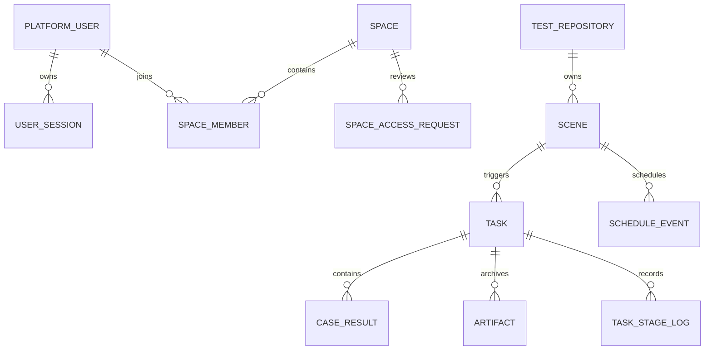
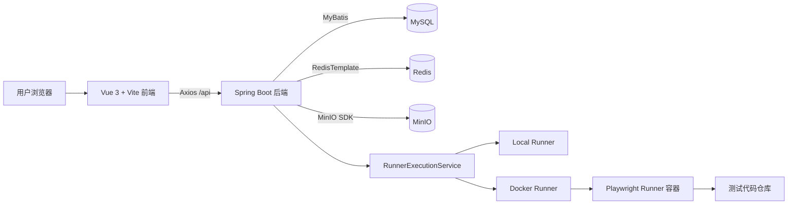
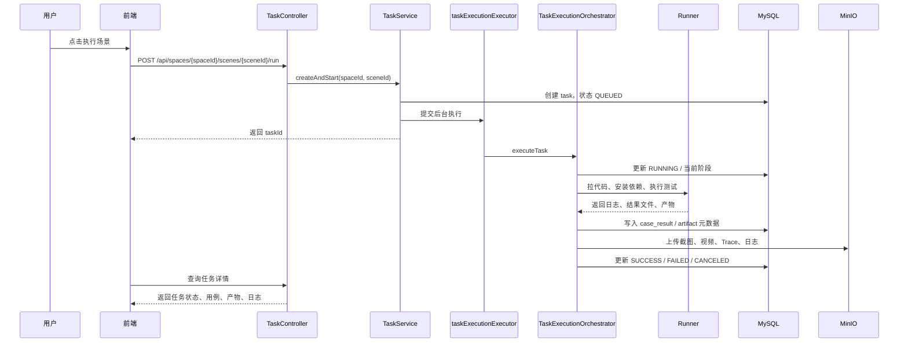
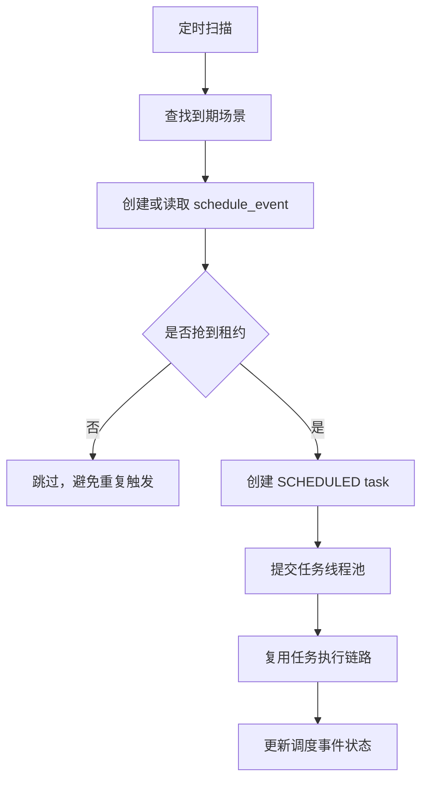
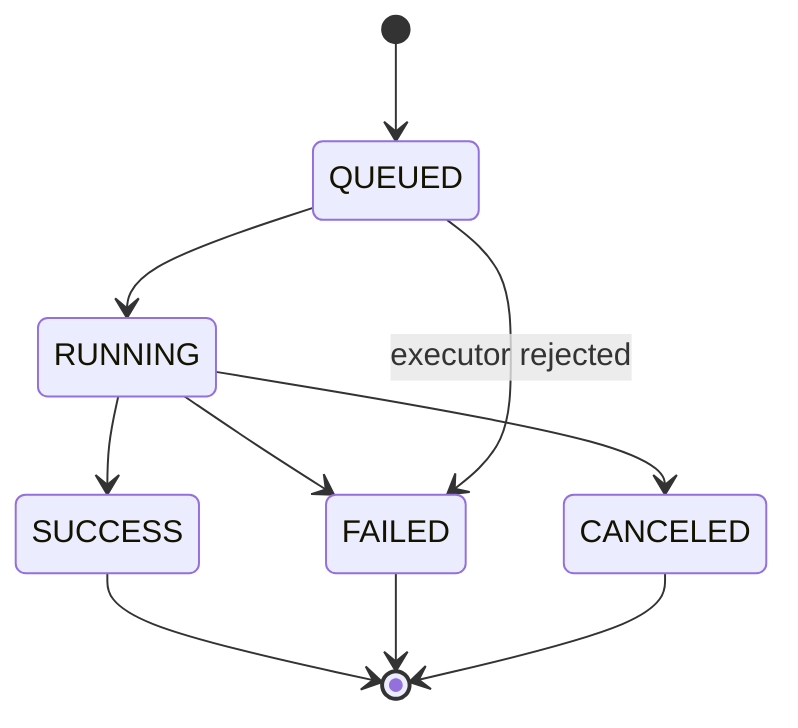
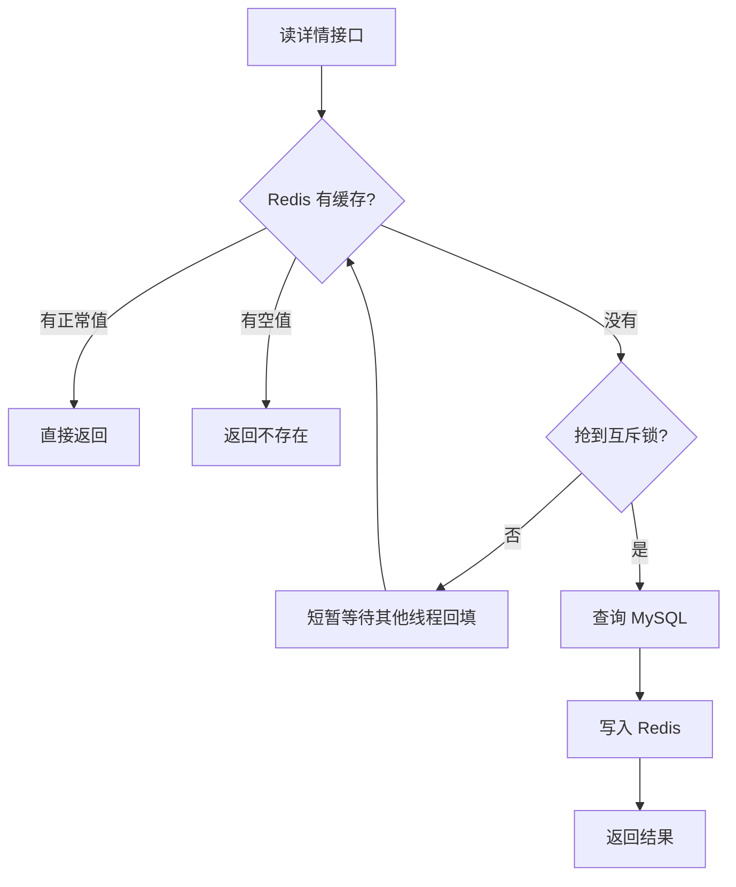
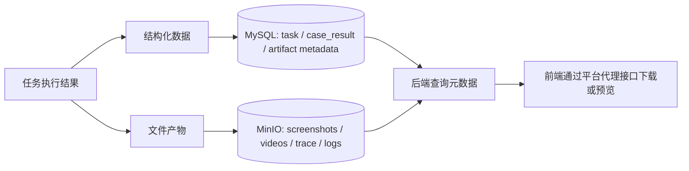
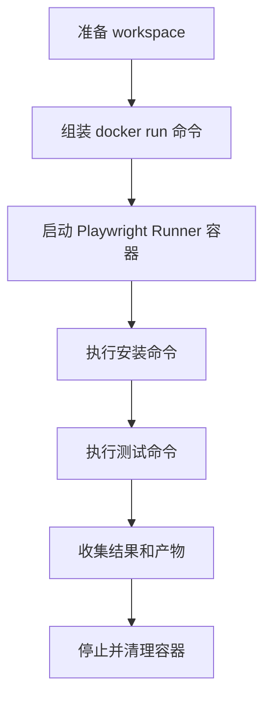
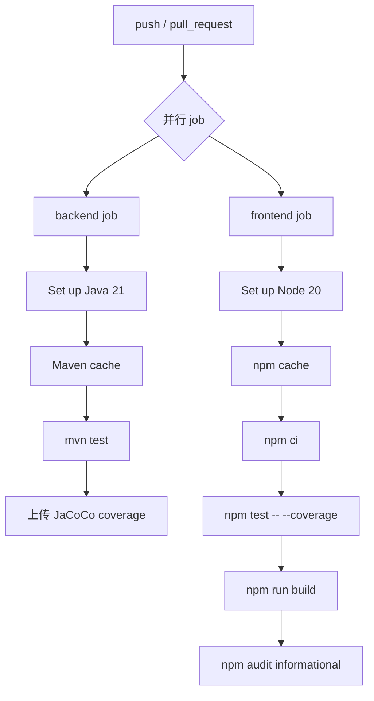

# Playwright Test Platform 项目理解与技术讲解指南

这份文档用于系统讲解项目结构、技术架构、文件职责、核心链路、Docker 和 CI。它不是简单罗列技术栈，而是帮助读者理解各模块为什么这样设计，以及它们如何协同工作。

---

## 1. 快速定位

### 1.1 一句话介绍

这是一个面向 Playwright 自动化测试的执行与管理平台。用户可以在页面上维护测试仓库、配置测试场景、手动或定时触发任务，并统一查看任务状态、用例结果、阶段日志、截图、视频、Trace 等运行产物。

### 1.2 简短介绍

这是一个 Playwright 自动化测试执行平台。前端使用 Vue 3、TypeScript、Pinia 和 Element Plus，负责仓库配置、场景配置、任务列表、任务详情、日志和产物展示。后端使用 Spring Boot、MyBatis、Flyway、Redis 和 MinIO，负责仓库和场景管理、任务异步执行、定时调度、结果解析和产物归档。MySQL 存结构化业务数据，Redis 做详情缓存，MinIO 存截图、视频、Trace 和阶段日志。任务执行不会阻塞 Web 请求线程，而是创建任务后交给专用线程池和 Runner 执行，这是项目区别于普通 CRUD 后台的核心点。

### 1.3 完整介绍

这个项目的核心对象是仓库、场景和任务。用户先配置测试仓库，包括 Git 地址、默认分支、安装命令、测试命令和结果文件路径；然后创建测试场景，选择分支、浏览器、测试选择器、环境变量和定时规则；最后通过手动或定时方式触发任务。

后端收到触发请求后，会先在 MySQL 中创建任务记录，状态进入 `QUEUED`，然后把任务提交给自定义线程池。任务执行器会准备 workspace、拉取代码、执行安装命令、执行 Playwright 测试命令、解析结果文件，把用例结果写入 MySQL，并把截图、视频、Trace、报告和日志上传到 MinIO。任务执行过程中的状态变更会拆成短事务独立提交，避免一个大事务包住外部命令和文件上传。

工程上，项目使用 Docker Compose 编排 MySQL、Redis、MinIO、后端和前端；开发环境使用 `Dockerfile.dev` 挂载源码，生产环境使用多阶段 `Dockerfile` 构建稳定镜像；CI 使用 GitHub Actions 分别跑后端测试、前端测试、覆盖率和前端构建。

---

## 2. 项目总览

### 2.1 业务对象关系图

### 2.2 核心对象说明

| 对象 | 对应表/模块 | 解决的问题 | 说明 |
|---|---|---|---|
| 用户 | `platform_user`、`user_session`、`auth` | 谁在使用平台、登录态如何维护 | 平台具备用户和会话模型，不是简单单用户后台 |
| 空间 | `space`、`space_member`、`space_access_request` | 多用户协作和权限边界 | 空间用于隔离资源，成员关系用于控制访问和审批 |
| 仓库 | `test_repository`、`repository` | 测试代码从哪里来，怎么安装和执行 | 仓库配置是测试执行的基础元数据 |
| 场景 | `scene`、`scene_schedule_state` | 在某个仓库里执行哪类测试 | 场景把分支、浏览器、选择器、环境变量和调度规则封装起来 |
| 任务 | `task`、`task` 模块 | 一次真实执行记录 | 任务承载状态机、执行参数快照、结果和耗时 |
| 用例结果 | `case_result` | 每条测试用例的执行结果 | 从 Playwright 结果文件解析后入库 |
| 产物 | `artifact`、MinIO | 截图、视频、Trace、报告等文件 | MySQL 存元数据，MinIO 存文件本体 |
| 调度事件 | `schedule_event` | 定时任务幂等和补偿 | 避免重复触发，并支持失败追踪和重试 |

---

## 3. 系统架构

### 3.1 总体架构图

### 3.2 分层架构

| 层级 | 主要组件 | 职责 | 说明 |
|---|---|---|---|
| 接入层 | Vue 页面、Axios、Spring Controller | 接收用户操作和 HTTP 请求 | Controller 保持薄，页面不直接写复杂业务 |
| 业务层 | Auth、Space、Repository、Scene、Task Service | 业务规则、状态流转、权限、任务编排 | 核心复杂度在 Service 和 Orchestrator |
| 数据层 | MyBatis Mapper、Flyway、MySQL | 数据读写和 schema 版本管理 | 纯 MyBatis 注解式 Mapper，Flyway 自动建表 |
| 缓存层 | Redis、DetailCacheService | 热点详情缓存和缓存保护 | 空值缓存、TTL 抖动、互斥锁 |
| 存储层 | MinIO、ObjectStorageService | 日志、截图、视频、Trace 存储 | 结构化数据和文件产物分离 |
| 执行层 | Runner、Docker Runner、Workspace | 执行外部测试仓库命令 | 隔离执行环境，避免污染后端服务 |
| 工程化层 | Docker Compose、Dockerfile、CI | 本地启动、生产部署、自动验证 | 开发/生产镜像分离，CI 前后端独立验证 |

### 3.3 架构设计亮点

| 设计点 | 解决的问题 | 设计价值 |
|---|---|---|
| 异步任务执行 | Playwright 任务耗时长，不能阻塞 HTTP 请求 | 避免 Web 请求线程被长任务占满 |
| 短事务状态落库 | 外部 IO 无法用数据库事务回滚 | 明确数据库事务与外部 IO 的边界 |
| Runner 抽象 | 测试执行环境复杂且可能污染服务环境 | 隔离测试执行环境，降低依赖污染 |
| MinIO 存产物 | 截图、视频、Trace 不适合存数据库 | 区分结构化数据和大文件存储 |
| Redis 详情缓存 | 热点详情读压力和缓存风险 | 降低热点读取压力并保护数据库 |
| Flyway 迁移 | 环境手动建表容易不一致 | 保证多环境 schema 一致 |
| Docker Compose | 本地环境依赖多、搭建成本高 | 降低本地启动和部署复杂度 |

---

## 4. 技术选型

### 4.1 前端技术选型

| 技术 | 项目中的作用 | 为什么选择 | 说明 |
|---|---|---|---|
| Vue 3 | 构建管理后台页面 | 组件化清晰，生态成熟 | 适合配置管理、任务详情这类交互页面 |
| TypeScript | 类型约束 | 减少接口字段不一致和状态错误 | 前后端 DTO 有类型约束，维护更稳 |
| Vite | 开发和构建工具 | 启动快、配置轻 | 开发阶段通过 Vite proxy 代理 `/api` |
| Vue Router | 页面路由 | 管理登录、仓库、场景、任务等页面 | 路由层负责页面边界 |
| Pinia | 状态管理 | 轻量、适配 Vue 3 | 把列表、详情、分页、loading 等状态从页面抽离 |
| Element Plus | UI 组件库 | 后台组件齐全 | 表格、表单、弹窗、分页效率高 |
| Axios | HTTP 客户端 | 请求/响应拦截方便 | 统一封装后端 `ApiResponse` |
| Vitest | 单元测试 | 和 Vite 生态一致 | 覆盖 store、工具函数、页面逻辑 |

### 4.2 后端技术选型

| 技术 | 项目中的作用 | 为什么选择 | 说明 |
|---|---|---|---|
| Spring Boot 3.5 | 后端应用框架 | Web、配置、DI、自动装配成熟 | 后端主体用 Spring Boot 承载业务和接口 |
| Spring Web | REST API | 标准 HTTP 接口开发 | 前后端通过 JSON API 通信 |
| MyBatis 注解 Mapper | 数据访问 | SQL 可控，适合任务状态和分页查询 | 项目不使用 JPA，也不使用 XML Mapper |
| Flyway | schema 迁移 | 自动建表和升级 | 保证多环境数据库结构一致 |
| MySQL 8 | 主业务数据库 | 适合结构化关系数据 | 保存用户、空间、仓库、场景、任务和结果 |
| Redis | 详情缓存 | 降低热点详情读取压力 | 不是主存储，而是缓存层 |
| MinIO | 对象存储 | 适合保存大文件产物 | 保存截图、视频、Trace 和日志 |
| Maven + JaCoCo | 构建和覆盖率 | Java 标准工程化工具 | CI 中自动跑测试并产出覆盖率 |

### 4.3 工程化选型

| 技术 | 作用 | 项目使用方式 |
|---|---|---|
| Docker | 容器化运行环境 | 后端、前端、MySQL、Redis、MinIO 都可容器化 |
| Docker Compose | 多服务编排 | 本地和单机生产环境一键启动 |
| Nginx | 前端生产部署 | 托管静态资源和反向代理 `/api` |
| GitHub Actions | CI | 自动执行前后端测试、覆盖率和构建 |

---

## 5. 前端文件职责

前端路径：`playwright-platform-web`

### 5.1 工程入口和配置

| 文件 | 职责 | 说明 |
|---|---|---|
| `package.json` | 依赖和脚本定义 | `dev`、`build`、`test` 分别对应开发、构建、测试 |
| `package-lock.json` | 锁定依赖版本 | 配合 `npm ci` 保证 CI 和 Docker 构建可复现 |
| `vite.config.ts` | Vite、代理、构建分包、Vitest 配置 | 开发阶段 `/api` 代理后端，避免跨域 |
| `index.html` | Vite HTML 入口 | Vue 应用挂载入口 |
| `src/main.ts` | 创建 Vue 应用 | 挂载 Pinia 和 Router |
| `src/App.vue` | 根组件和全局壳层 | 承载侧边栏、用户区、空间切换等布局 |
| `src/style.css` | 全局样式 | 管理全局视觉风格 |

### 5.2 API 层

| 文件 | 对应业务 | 职责 |
|---|---|---|
| `src/api/http.ts` | 通用请求 | Axios 实例、统一响应解包、错误处理基础 |
| `src/api/auth.ts` | 用户认证 | 登录、注册、当前用户、头像、资料 |
| `src/api/space.ts` | 空间协作 | 空间列表、广场、申请、审批 |
| `src/api/repository.ts` | 仓库管理 | 仓库 CRUD |
| `src/api/scene.ts` | 场景管理 | 场景 CRUD |
| `src/api/schedule-event.ts` | 调度事件 | 异常调度事件查看和重试 |
| `src/api/task.ts` | 任务管理 | 执行、取消、列表、详情、日志、产物、用例 |

说明：

> API 层把页面和 HTTP 细节隔离开，页面不直接拼 URL，也不直接处理后端统一响应结构。

### 5.3 Store 层

| 文件 | 管理状态 | 说明 |
|---|---|---|
| `src/stores/auth.ts` | 当前用户、登录态、公钥、头像 | 登录态恢复和用户资料状态集中管理 |
| `src/stores/space.ts` | 空间列表、当前空间、申请审批 | 支撑空间隔离和协作 |
| `src/stores/repository.ts` | 仓库列表、分页、保存删除 | 页面只关心展示和交互 |
| `src/stores/scene.ts` | 场景列表、详情、保存删除 | 场景配置状态集中管理 |
| `src/stores/schedule-event.ts` | 调度事件列表和重试 | 支撑调度问题排查页 |
| `src/stores/task.ts` | 任务列表、详情、日志、用例、产物 | 任务模块最复杂，承载详情页数据聚合 |

### 5.4 页面层

| 文件 | 页面 | 说明 |
|---|---|---|
| `src/views/auth/LoginView.vue` | 登录/注册 | 用户入驻入口 |
| `src/views/home/HomeView.vue` | 空间广场 | 展示可访问空间和申请状态 |
| `src/views/repository/RepositoryListView.vue` | 仓库管理 | 测试仓库配置入口 |
| `src/views/scene/SceneListView.vue` | 场景管理 | 配置浏览器、分支、环境变量、Cron |
| `src/views/scene/ScheduleEventListView.vue` | 调度事件 | 定时任务问题排查 |
| `src/views/task/TaskListView.vue` | 任务列表 | 查看任务历史和状态 |
| `src/views/task/TaskDetailView.vue` | 任务详情 | 展示状态、用例、日志、产物、诊断 |
| `src/views/task/useTaskDetailLoader.ts` | 详情加载逻辑 | 把复杂加载逻辑从 Vue 页面抽出 |
| `src/views/task/useTaskListLifecycle.ts` | 列表生命周期 | 管理任务列表刷新和轮询 |
| `src/views/space/SpaceAccessRequestListView.vue` | 空间审批 | 处理加入或升级权限请求 |
| `src/views/space/SpaceNoAccessView.vue` | 无权限页 | 用户申请加入空间 |

### 5.5 组件、类型和工具

| 类型 | 文件 | 职责 |
|---|---|---|
| 布局组件 | `SidebarUserPanel.vue`、`SpaceSwitcher.vue` | 用户区、空间切换 |
| 列表组件 | `ListPageShell.vue` | 复用列表页壳层 |
| 类型定义 | `src/types/*.ts` | DTO 和页面模型类型 |
| 工具函数 | `artifact.ts`、`stage-log.ts`、`task-display.ts` | 产物、日志、任务状态展示 |
| 错误与提示 | `error.ts`、`ui-feedback.ts` | 错误解析和 UI 提示 |
| 权限工具 | `space-permissions.ts`、`space-access-requests.ts` | 空间权限和申请状态判断 |

---

## 6. 后端文件职责

后端路径：`playwright-platform-server`

### 6.1 工程入口和配置

| 文件 | 职责 | 说明 |
|---|---|---|
| `pom.xml` | Maven 依赖和构建配置 | Spring Boot、MyBatis、Flyway、Redis、MinIO、测试依赖 |
| `Dockerfile.dev` | 开发镜像 | Maven 镜像运行 `spring-boot:run`，适合挂载源码 |
| `Dockerfile` | 生产镜像 | 多阶段构建，运行阶段只保留 JRE + jar |
| `.dockerignore` | 构建上下文过滤 | 避免无关文件进入镜像 |
| `PlatformApplication.java` | 启动类 | 启动 Spring Boot，开启调度和 Mapper 扫描 |
| `application.yml` | 主配置 | 数据源、Redis、Flyway、缓存、线程池、Runner、MinIO |
| `application-dev.yml` | 开发配置 | 仍然通过环境变量注入敏感配置 |

### 6.2 数据库迁移

| 文件 | 作用 | 说明 |
|---|---|---|
| `V1__init_schema.sql` | 初始化核心表 | 仓库、场景、任务、用例、产物、日志、调度状态、审计 |
| `V2__add_schedule_event.sql` | 增加调度事件 | 支撑定时任务幂等和事件记录 |
| `V3__schedule_event_retry_and_failure_category.sql` | 调度重试和失败分类 | 支撑失败排查和重试 |
| `V4__add_space_model.sql` | 空间模型 | 空间、成员、申请审批 |
| `V5__add_platform_user_and_user_session.sql` | 用户和会话 | 登录态和平台用户 |
| `V6__add_self_service_registration_constraints.sql` | 注册约束 | 自助注册唯一性和约束 |
| `SCHEMA_OVERVIEW.sql` | schema 总览 | 方便整体理解数据库结构 |

### 6.3 后端模块总览

| 模块 | 核心文件 | 主要职责 | 说明 |
|---|---|---|---|
| `common` | `ApiResponse`、`GlobalExceptionHandler`、`RequestCorrelationFilter` | 统一响应、异常处理、请求链路 ID | 平台基础能力 |
| `auth` | `AuthController`、`AuthServiceImpl`、`AuthSessionFilter` | 登录、注册、会话、当前用户 | 不是无认证后台 |
| `space` | `SpaceServiceImpl`、`SpaceAuthorizationServiceImpl` | 空间、成员、审批、权限 | 多用户协作边界 |
| `repository` | `RepositoryController`、`RepositoryServiceImpl`、`TestRepositoryMapper` | 仓库 CRUD 和级联删除 | 测试执行基础配置 |
| `scene` | `SceneServiceImpl`、`SceneSchedulerServiceImpl`、`ScheduleEventServiceImpl` | 场景配置、定时调度、调度事件 | 定时任务和幂等控制 |
| `task` | `TaskServiceImpl`、`TaskExecutionOrchestrator`、`TaskExecutionMutationService` | 任务创建、执行、取消、归档、详情 | 项目最核心模块 |
| `runner` | `DockerRunnerCommandExecutor`、`RunnerExecutionServiceImpl` | 命令执行环境抽象 | local/docker 策略 |
| `storage` | `MinioObjectStorageService`、`MinioConfig` | 对象存储 | 产物归档 |
| `cache` | `DetailCacheService`、`CacheProperties` | Redis 详情缓存 | 缓存保护设计 |
| `audit` | `PlatformAuditLogMapper` | 审计日志 | 操作可追溯 |

### 6.4 Task 模块展开

| 文件 | 职责 | 为什么重要 |
|---|---|---|
| `TaskController.java` | 暴露任务执行、取消、详情、日志、产物接口 | HTTP 边界 |
| `TaskServiceImpl.java` | 任务应用服务入口 | 串联创建、查询、取消、异步提交 |
| `TaskCreationService.java` | 创建任务初始记录 | 保存场景快照，任务进入 `QUEUED` |
| `TaskExecutionConfig.java` | 定义任务线程池 | 避免阻塞 Web 请求线程 |
| `TaskExecutionOrchestrator.java` | 编排任务生命周期 | 项目核心复杂度所在 |
| `TaskExecutionMutationService.java` | 短事务状态落库 | 避免长任务包大事务 |
| `TaskCommandBuilderImpl.java` | 生成执行命令 | 把配置转换成真实命令 |
| `TaskCaseResultParseServiceImpl.java` | 解析 Playwright 结果 | 从结果文件提取用例数据 |
| `TaskArtifactArchiveServiceImpl.java` | 归档产物 | 上传 MinIO 并写 artifact 元数据 |
| `TaskStageLogServiceImpl.java` | 阶段日志管理 | 支撑任务可观测性 |
| `TaskQueryViewService.java` | 组装详情视图 | 给前端返回聚合后的展示数据 |
| `TaskRecoveryService.java` | 异常恢复 | 处理异常退出或卡住任务 |

---

## 7. 核心业务链路

### 7.1 手动执行链路图

### 7.2 手动执行步骤表

| 步骤 | 发生位置 | 做什么 | 设计意义 |
|---|---|---|---|
| 1 | 前端 | 用户点击执行 | 用户入口 |
| 2 | Controller | 接收 `/api/spaces/{spaceId}/scenes/{sceneId}/run` | HTTP 边界保持薄，并校验空间权限 |
| 3 | Service | 创建 `task` | 先落库，任务可追踪 |
| 4 | 线程池 | 提交异步执行 | 不阻塞请求线程 |
| 5 | Orchestrator | 准备 workspace | 隔离每次任务目录 |
| 6 | Runner | 拉代码、安装、测试 | 执行外部测试仓库命令 |
| 7 | Parser | 解析 Playwright 结果 | 提取用例结果 |
| 8 | Storage | 上传产物到 MinIO | 大文件不进 MySQL |
| 9 | Mutation | 状态短事务落库 | 避免长事务 |
| 10 | 前端 | 查询详情展示 | 用户可观测 |

### 7.3 定时调度链路图

### 7.4 任务状态流转

### 7.5 取消任务链路

| 步骤 | 说明 |
|---|---|
| 前端请求 | 调用 `POST /api/spaces/{spaceId}/tasks/{taskId}/cancel` |
| 写取消标记 | 后端设置 `cancel_requested`、`cancel_requested_at`、`cancel_requested_by` |
| 执行器感知 | Runner 或执行流程检查取消标记 |
| 清理资源 | Docker Runner 尝试停止并移除容器 |
| 状态落库 | 更新任务状态并清理 Redis 任务详情缓存 |

---

## 8. 数据库设计

### 8.1 表结构分类

| 类型 | 表 | 作用 |
|---|---|---|
| 用户与权限 | `platform_user`、`user_session`、`space`、`space_member`、`space_access_request` | 用户、登录态、空间协作和审批 |
| 配置数据 | `test_repository`、`scene` | 测试仓库和测试场景配置 |
| 运行数据 | `task`、`case_result`、`artifact`、`task_stage_log` | 任务执行、用例结果、产物和日志 |
| 调度数据 | `scene_schedule_state`、`schedule_event` | 定时触发、租约、幂等、重试 |
| 审计数据 | `platform_audit_log` | 操作可追溯 |
| 迁移数据 | `flyway_schema_history` | Flyway 执行历史 |

### 8.2 核心表解释

| 表 | 核心字段 | 说明 |
|---|---|---|
| `test_repository` | `git_url`、`default_branch`、`install_command`、`run_command_template` | 平台知道去哪拉代码、怎么安装、怎么跑测试 |
| `scene` | `repo_id`、`branch`、`browser`、`env_json`、`cron_expression` | 场景是一次测试执行配置模板 |
| `task` | `status`、`current_stage`、`started_at`、`finished_at`、`result_code` | 任务是一条真实执行记录，带状态机 |
| `case_result` | `task_id`、`full_name`、`status`、`duration_ms` | 存每条用例结果 |
| `artifact` | `bucket`、`object_key`、`content_type`、`size` | 存产物元数据，文件本体在 MinIO |
| `task_stage_log` | `stage`、`stream_type`、`object_key`、`preview_text` | 保存阶段日志索引和预览 |
| `schedule_event` | `scene_id`、`planned_fire_at`、`status` | 让调度可追踪、可重试、可幂等 |

### 8.3 为什么 MyBatis + Flyway

| 选择 | 原因 | 说明 |
|---|---|---|
| MyBatis | SQL 可控，适合分页、状态更新和复杂查询 | 项目是任务执行平台，显式 SQL 比 JPA 更透明 |
| 注解 Mapper | 避免 XML 分散，代码内即可看到 SQL | 当前后端是纯 MyBatis 注解式 Mapper |
| Flyway | 自动建表、自动升级、记录版本 | 新环境启动时自动执行迁移脚本，不需要手动建表 |

---

## 9. Redis 缓存设计

### 9.1 Redis 读流程图

### 9.2 当前缓存范围

| 接口 | Redis key | 是否先查 Redis |
|---|---|---|
| `GET /api/spaces/{spaceId}/repos/{id}` | `detail:repository:{id}` | 是 |
| `GET /api/spaces/{spaceId}/scenes/{id}` | `detail:scene:{id}` | 是 |
| `GET /api/spaces/{spaceId}/tasks/{taskId}` | `detail:task:{taskId}` | 是 |
| `GET /api/spaces/{spaceId}/repos` | 无 | 否，直接分页查 MySQL |
| `GET /api/spaces/{spaceId}/scenes` | 无 | 否，直接分页查 MySQL |
| `GET /api/spaces/{spaceId}/tasks` | 无 | 否，直接分页查 MySQL |
| 日志/产物/用例接口 | 无 | 否，直接查 MySQL 或 MinIO 相关服务 |

### 9.3 缓存保护策略

| 风险 | 解决方式 | 项目实现 |
|---|---|---|
| 缓存穿透 | 空值缓存 | 查不到也写短 TTL 空值 |
| 缓存击穿 | 互斥锁 | Redis `setIfAbsent` 加锁，配合本地锁 |
| 缓存雪崩 | TTL 抖动 | 基础 TTL 加随机秒数 |
| 脏数据 | 写后失效 | create/update/delete 后删除详情缓存 |

说明：

> Redis 在这里不是主存储，而是用于读多写少的详情接口。缓存设计不是简单 get/set，而是考虑了穿透、击穿、雪崩和写后失效。

---

## 10. MinIO 对象存储设计

### 10.1 存储分工图

### 10.2 存储内容

| 数据 | 存储位置 | 原因 |
|---|---|---|
| 任务状态 | MySQL | 结构化查询 |
| 用例结果 | MySQL | 需要分页、统计、筛选 |
| 产物元数据 | MySQL | 保存 bucket、objectKey、类型、大小 |
| 截图/视频/Trace | MinIO | 大文件适合对象存储 |
| 阶段日志文件 | MinIO | 日志可能较大，适合对象存储 |
| 头像 | MinIO | 图片文件适合对象存储 |

### 10.3 bucket 初始化

| 方式 | 作用 | 是否必须 |
|---|---|---|
| 后端 `ensureBucket` | 上传前检查并创建 bucket | 当前实际方式，Compose 不再依赖额外初始化容器 |

---

## 11. 多线程与事务

### 11.1 线程职责

| 线程/线程池 | 负责什么 | 不负责什么 |
|---|---|---|
| Tomcat 请求线程 | 接收 HTTP 请求、参数校验、快速返回 | 不直接执行 Playwright 长任务 |
| `taskExecutionExecutor` | 拉代码、安装依赖、执行测试、归档产物 | 不处理普通 Web 请求 |
| Runner 容器进程 | 执行测试仓库命令 | 不承载平台 Web 服务 |

### 11.2 事务边界

| 操作 | 是否事务 | 说明 |
|---|---|---|
| 仓库 create/update/delete | 是，短事务 | 数据库写入后清缓存 |
| 场景 create/update/delete | 是，短事务 | 包含调度时间更新 |
| 任务创建 | 是，短事务 | 先落库再异步执行 |
| 任务取消 | 是，短事务 | 写取消标记 |
| 任务执行全过程 | 否 | 不用一个大事务包住外部 IO |
| 状态变更落库 | 是，独立短事务 | 每个关键状态独立提交 |

### 11.3 说明

> 长任务不能包大事务，因为 Git、Docker、文件系统和 MinIO 都不是数据库事务能回滚的资源。项目把任务执行和状态落库拆开，每次状态变更用短事务提交，既保证状态可追踪，也避免长时间占用数据库连接。

---

## 12. Runner 设计

### 12.1 Runner 模式对比

| 模式 | 执行方式 | 优点 | 风险/限制 |
|---|---|---|---|
| local | 在服务所在环境直接执行命令 | 简单，适合本地开发 | 容易污染服务环境 |
| docker | 启动短生命周期容器执行命令 | 隔离性好，环境一致 | 需要 Docker socket 权限 |

### 12.2 Docker Runner 流程

### 12.3 说明

> Runner 抽象的价值是隔离测试执行环境。平台执行的是外部仓库命令，不同仓库依赖可能不同，用 Docker Runner 可以减少环境污染，也方便限制 CPU、内存和 workspace。

---

## 13. Docker Compose

Dockerfile、Dockerfile.dev、.dockerignore 与 Compose 的完整职责划分见 `docs/docker.md`。本节只保留 Docker 总览。

### 13.1 开发与生产 Compose 对比

| 对比项 | `docker-compose.yml` | `docker-compose.prod.yml` |
|---|---|---|
| 定位 | 本地开发 | 单机生产部署 |
| 后端镜像 | `Dockerfile.dev` | `Dockerfile` |
| 前端镜像 | `Dockerfile.dev` | `Dockerfile` |
| 后端运行方式 | `mvn spring-boot:run` | `java -jar app.jar` |
| 前端运行方式 | Vite dev server | Nginx 托管 `dist` |
| 源码挂载 | 挂载源码 | 不挂载源码 |
| 端口暴露 | MySQL、Redis、MinIO、server、web | 主要暴露 web 和 MinIO 可选端口 |
| restart 策略 | 开发环境不强调 | `restart: unless-stopped` |
| 适用场景 | 本地调试、热更新 | 服务器部署 |

### 13.2 Compose 服务说明

| 服务 | 作用 | 说明 |
|---|---|---|
| `mysql` | 业务数据库 | 保存结构化数据 |
| `redis` | 缓存 | 保存详情缓存和互斥锁 key |
| `minio` | 对象存储 | 保存截图、视频、Trace、日志 |
| `server` | Spring Boot 后端 | 提供 API 和任务编排 |
| `web` | Vue 前端 | 开发环境 Vite，生产环境 Nginx |

### 13.3 healthcheck 说明

| 服务 | 检查方式 | 作用 |
|---|---|---|
| MySQL | `mysqladmin ping` | 确认数据库能连接 |
| Redis | `redis-cli ping` | 确认 Redis 可用且密码正确 |
| MinIO | `/minio/health/live` | 确认对象存储服务已就绪 |

说明：

> healthcheck 不是判断容器是否启动，而是判断服务是否真的可用。后端通过 `depends_on.condition: service_healthy` 等待依赖健康后再启动，减少启动时连接失败。

### 13.4 `.env` 管理

| 配置类型 | 示例 | 是否提交 Git |
|---|---|---|
| 端口 | `PLATFORM_WEB_HOST_PORT`、`PLATFORM_MYSQL_HOST_PORT` | 否 |
| 密码 | `PLATFORM_DB_PASSWORD`、`PLATFORM_REDIS_PASSWORD` | 否 |
| MinIO | `PLATFORM_MINIO_ACCESS_KEY`、`PLATFORM_MINIO_SECRET_KEY` | 否 |
| Runner | `PLATFORM_RUNNER_MODE`、`PLATFORM_RUNNER_DOCKER_IMAGE` | 否 |

---

## 14. Dockerfile

### 14.1 开发 Dockerfile

| 文件 | 基础镜像 | 作用 |
|---|---|---|
| `playwright-platform-server/Dockerfile.dev` | Maven + JDK 21 | 挂载源码后运行 `mvn spring-boot:run` |
| `playwright-platform-web/Dockerfile.dev` | Node 20 | 挂载源码后运行 `npm ci && npm run dev` |

### 14.2 生产 Dockerfile

| 文件 | 构建阶段 | 运行阶段 | 作用 |
|---|---|---|---|
| `playwright-platform-server/Dockerfile` | Maven 打包 jar | JRE 运行 jar | 减小运行镜像，不带 Maven |
| `playwright-platform-web/Dockerfile` | Node 构建 `dist` | Nginx 托管静态资源 | 构建环境和运行环境分离 |

说明：

> 开发镜像强调热更新和调试，生产镜像强调稳定、小体积和可部署，所以开发和生产 Dockerfile 分开。

---

## 15. 前端代理和生产 Nginx

### 15.1 请求路径对比

| 环境 | 请求链路 | 作用 |
|---|---|---|
| 开发 | 浏览器 -> Vite `5173` -> `/api` proxy -> server `8080` | 避免本地跨域 |
| 单机生产 | 浏览器 -> Nginx `80` -> `/api` proxy -> server `8080` | 前后端同机部署 |
| 正式分域名 | 前端域名 -> API 域名 | 边界更清晰，需 CORS |

### 15.2 Nginx 作用

| 配置 | 作用 |
|---|---|
| `try_files $uri $uri/ /index.html` | SPA 路由 fallback |
| `location /api/` | 反向代理后端 |
| `location /assets/` | 静态资源长缓存 |

---

## 16. CI

### 16.1 CI 流程图

### 16.2 CI 任务表

| Job | 步骤 | 目的 |
|---|---|---|
| backend | Checkout | 获取代码 |
| backend | Setup Java 21 | 准备后端构建环境 |
| backend | Maven cache | 加速依赖下载 |
| backend | `mvn test` | 执行后端测试和 JaCoCo |
| backend | upload coverage | 保存覆盖率报告 |
| frontend | Setup Node 20 | 准备前端构建环境 |
| frontend | `npm ci` | 可复现安装依赖 |
| frontend | `npm test -- --coverage` | 执行前端测试和覆盖率 |
| frontend | `npm run build` | 验证前端可构建 |
| frontend | `npm audit` | 高危依赖审计，当前不阻塞 |

### 16.3 CI 可优化方向

| 当前缺口 | 后续优化 |
|---|---|
| 未构建 Docker 镜像 | 增加镜像构建 job |
| 未做镜像漏洞扫描 | 接入 Trivy 或类似工具 |
| 未自动部署 | 增加 CD 流水线 |
| 无覆盖率阈值 | 增加质量门禁 |
| 无 E2E | 增加关键链路端到端测试 |

---

## 17. 测试体系

### 17.1 测试分布

| 端 | 目录 | 覆盖重点 |
|---|---|---|
| 后端 | `playwright-platform-server/src/test/java` | Controller、Service、Mapper、Runner、缓存、MinIO、调度、事务 |
| 前端 | `playwright-platform-web/tests/unit` | Store、Router、页面逻辑、工具函数、任务详情加载 |

### 17.2 说明

> 后端测试更关注业务规则、数据访问和基础设施边界；前端测试更关注状态管理、页面逻辑和工具函数。CI 会自动跑这些测试并上传覆盖率，形成基础质量门禁。

---

## 18. 项目亮点和不足

### 18.1 项目亮点

| 亮点 | 对应模块 | 说明 |
|---|---|---|
| 异步任务编排 | `TaskServiceImpl`、`TaskExecutionOrchestrator` | 请求线程和执行线程分离 |
| Runner 抽象 | `runner` 模块 | 支持 local/docker 两种执行模式 |
| 对象存储归档 | `storage`、`artifact` | 大文件进 MinIO，元数据进 MySQL |
| Redis 缓存保护 | `DetailCacheService` | 考虑穿透、击穿、雪崩 |
| Flyway 迁移 | `db/migration` | 自动建表和 schema 演进 |
| 调度幂等 | `schedule_event`、租约 | 避免定时任务重复触发 |
| 工程化完整 | Compose、Dockerfile、CI | 能开发、部署、测试闭环 |

### 18.2 当前不足和优化方向

| 不足 | 风险 | 优化方向 |
|---|---|---|
| Docker socket 权限较高 | server 能控制宿主机 Docker | Runner 独立成执行节点 |
| CI 没有镜像构建 | 还不能直接发布镜像 | 增加 Docker build/push |
| 没有完整 CD | 部署仍需手动 | 增加自动部署流水线 |
| 缺少运行时监控 | 任务和资源指标不可视 | 接入 Prometheus/Grafana |
| 分域名配置还需完善 | 正式部署需 CORS 和 API base URL | 增加前端环境变量和后端 CORS |

---

## 19. 高频问题讲解

### 19.1 问题索引

| 问题类型 | 常见问题 | 说明要点 |
|---|---|---|
| 项目背景 | 这个项目解决什么问题？ | 测试执行平台化、结果统一、产物归档 |
| 架构设计 | 前后端怎么分工？ | Vue 展示和状态，Spring Boot 业务和编排 |
| 任务执行 | 为什么异步？ | 防超时、防阻塞、线程池 |
| 数据库 | 为什么 MyBatis + Flyway？ | SQL 可控、schema 可演进 |
| 缓存 | Redis 用在哪里？ | 详情缓存、穿透击穿雪崩 |
| 存储 | 为什么 MinIO？ | 大文件对象存储 |
| Docker | Compose 做什么？ | 本地依赖编排、单机部署 |
| CI | CI 做了什么？ | 测试、覆盖率、构建 |
| 风险 | 项目有什么不足？ | Docker socket、CD、监控 |

### Q1：这个项目最核心的业务链路是什么？

答：

最核心的是“场景触发任务 -> 异步执行测试 -> 解析结果 -> 归档产物 -> 前端展示详情”。用户配置仓库和场景后，后端创建 task，交给专用线程池和 Runner 执行，执行完成后把用例结果写 MySQL，把截图、视频、Trace 和日志写 MinIO，前端再统一展示任务结果。

### Q2：为什么任务执行要异步？

答：

因为 Playwright 执行涉及拉代码、安装依赖、运行测试和上传产物，耗时长且外部 IO 多。如果直接在请求线程里执行，接口会超时，也会占满 Tomcat 线程。异步后，接口只负责创建任务和返回，任务在后台线程池执行，系统稳定性更好。

### Q3：为什么用 MyBatis，不用 JPA？

答：

这个项目的数据访问更偏显式 SQL 控制，例如分页、状态更新、任务结果查询和调度状态更新。MyBatis 更透明，SQL 可控，适合这种偏后台任务系统的场景。项目现在是纯注解式 MyBatis，没有 JPA，也没有 XML Mapper。

### Q4：Flyway 有什么作用？

答：

Flyway 负责数据库版本管理。新环境启动后，后端会自动执行 `db/migration` 下的 SQL 文件创建或升级表结构，并在 `flyway_schema_history` 里记录版本，避免手动建表导致环境不一致。

### Q5：Redis 在这里的价值是什么？

答：

Redis 主要做详情缓存，例如仓库详情、场景详情、任务详情。读详情时先查 Redis，未命中再查 MySQL 并写回缓存。缓存设计包含空值缓存、TTL 抖动和互斥锁，用来应对穿透、雪崩和击穿。

### Q6：为什么用 MinIO？

答：

测试产物是截图、视频、Trace、日志这类文件，不适合直接存 MySQL。MySQL 只保存结构化元数据，MinIO 保存文件本体，这样查询和文件归档职责清晰。

### Q7：Docker Runner 为什么有价值？

答：

平台执行的是外部测试仓库命令，不同仓库依赖可能不同，直接在后端服务环境里执行会污染环境。Docker Runner 可以用短生命周期容器隔离执行环境，减少依赖冲突，也方便限制资源。

### Q8：Docker Compose 在项目里解决什么问题？

答：

Compose 解决环境编排问题。本地开发时一条命令启动 MySQL、Redis、MinIO、后端和前端，减少环境搭建成本。生产 Compose 则使用生产镜像和 restart 策略，适合单机部署。

### Q9：开发 Compose 和生产 Compose 有什么区别？

答：

开发 Compose 使用 `Dockerfile.dev`，挂载源码，适合热更新；生产 Compose 使用多阶段生产 `Dockerfile`，后端运行 jar，前端由 Nginx 托管静态资源，不再依赖源码挂载，更稳定。

### Q10：CI 做了什么？

答：

CI 分后端和前端两个 job。后端安装 Java 21 并执行 `mvn test`，上传 JaCoCo 覆盖率；前端安装 Node 20，执行 `npm ci`、`npm test -- --coverage`、`npm run build`，并做 npm audit 信息提示。

### Q11：怎么保证任务状态不会因为异常丢失？

答：

任务执行过程中的状态落库拆成短事务，不把整个外部执行流程包进一个大事务。即使安装、测试、归档某个阶段失败，也会尽量记录失败状态和错误信息，方便前端展示和后续排查。

### Q12：如果继续优化，你会先做什么？

答：

优先优化两件事：第一，把 Runner 从后端服务中进一步拆出来，降低 Docker socket 权限风险；第二，完善 CI/CD，增加 Docker 镜像构建、镜像扫描和自动部署。

---

## 20. 讲解模板

### 20.1 项目背景

说明：

> 这个项目主要解决自动化测试执行平台化的问题。传统方式下，测试执行命令、环境变量、结果文件和产物都分散在不同仓库和机器上，查询和追踪成本很高。这个平台把仓库配置、场景配置、任务触发、结果解析和产物归档统一起来。

### 20.2 技术架构

说明：

> 架构上是前后端分离。前端 Vue 3 + TypeScript + Pinia，负责配置和结果展示；后端 Spring Boot + MyBatis + Flyway，负责业务规则、任务编排和数据持久化。MySQL 存结构化数据，Redis 做详情缓存，MinIO 存测试产物，Docker Runner 负责隔离执行测试命令。

### 20.3 核心链路

说明：

> 用户在前端触发场景后，后端先创建任务记录，然后提交到专用线程池。任务执行器准备 workspace，拉取测试仓库，执行安装命令和测试命令，解析 Playwright 结果文件，把用例结果写入 MySQL，把截图、视频、Trace 和日志上传到 MinIO，最后更新任务状态。前端通过任务详情接口展示完整结果。

### 20.4 设计理解

说明：

> 这个项目的关键不只是页面和接口，而是任务执行的可靠性和可观测性。比如长任务不能阻塞请求线程，外部 IO 不能包在大事务里，测试产物不能直接塞进数据库，缓存也要考虑穿透、击穿和雪崩。这些设计覆盖了后端工程和部署运维中的关键边界。

---

## 21. 重点阅读文件

### 21.1 后端

| 文件 | 为什么要看 |
|---|---|
| `PlatformApplication.java` | 启动配置、调度、Mapper 扫描 |
| `application.yml` | 数据源、Redis、缓存、线程池、Runner、MinIO 配置 |
| `V1__init_schema.sql` | 初始核心表 |
| `V2__add_schedule_event.sql` | 调度事件表 |
| `RepositoryServiceImpl.java` | 仓库 CRUD 和缓存失效 |
| `SceneServiceImpl.java` | 场景 CRUD、Cron、缓存失效 |
| `SceneSchedulerServiceImpl.java` | 定时调度入口 |
| `TaskController.java` | 任务 HTTP 接口 |
| `TaskServiceImpl.java` | 任务应用服务 |
| `TaskExecutionOrchestrator.java` | 任务执行编排核心 |
| `TaskExecutionMutationService.java` | 短事务状态落库 |
| `DockerRunnerCommandExecutor.java` | Docker Runner 执行 |
| `DetailCacheService.java` | Redis 缓存保护 |
| `MinioObjectStorageService.java` | 对象存储上传和预签名 |

### 21.2 前端

| 文件 | 为什么要看 |
|---|---|
| `src/main.ts` | Vue 应用入口 |
| `src/App.vue` | 全局布局 |
| `src/router/index.ts` | 页面路由 |
| `src/api/http.ts` | Axios 封装 |
| `src/stores/task.ts` | 任务状态管理 |
| `src/stores/repository.ts` | 仓库状态管理 |
| `src/stores/scene.ts` | 场景状态管理 |
| `RepositoryListView.vue` | 仓库页面 |
| `SceneListView.vue` | 场景页面 |
| `TaskListView.vue` | 任务列表 |
| `TaskDetailView.vue` | 任务详情 |
| `useTaskDetailLoader.ts` | 任务详情加载逻辑 |
| `vite.config.ts` | Vite 代理、构建和测试配置 |
| `nginx.conf` | 生产前端代理和 SPA fallback |

### 21.3 工程化

| 文件 | 为什么要看 |
|---|---|
| `docker-compose.yml` | 本地开发编排 |
| `docker-compose.prod.yml` | 单机生产编排 |
| `playwright-platform-server/Dockerfile` | 后端生产镜像 |
| `playwright-platform-server/Dockerfile.dev` | 后端开发镜像 |
| `playwright-platform-web/Dockerfile` | 前端生产镜像 |
| `playwright-platform-web/Dockerfile.dev` | 前端开发镜像 |
| `.github/workflows/ci.yml` | CI 流水线 |
| `docs/deployment.md` | 部署说明 |

---

## 22. 最后一段总结

总结：

> 这个项目是一个 Playwright 自动化测试执行平台，以仓库、场景和任务为核心对象。前端负责配置管理和结果展示，后端负责异步任务编排、定时调度、Runner 执行、结果解析和产物归档。MySQL 存结构化业务数据，Redis 做详情缓存，MinIO 存截图、视频、Trace 和日志。工程上使用 Docker Compose 统一开发和单机生产部署，用 GitHub Actions 做前后端测试、覆盖率和构建验证。它相比普通 CRUD 项目，覆盖了异步任务、缓存、对象存储、容器化和 CI 的综合理解。
